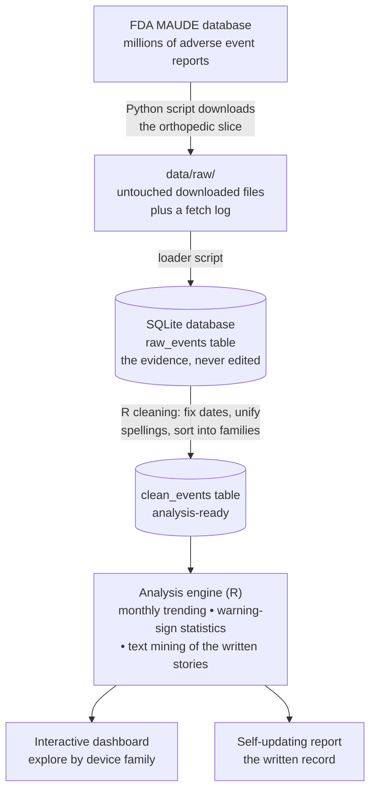
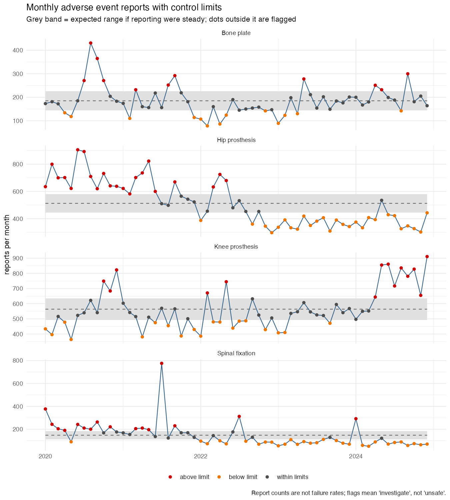
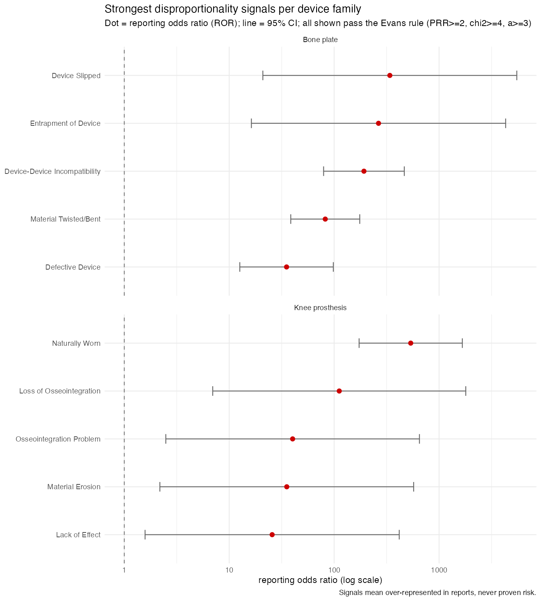
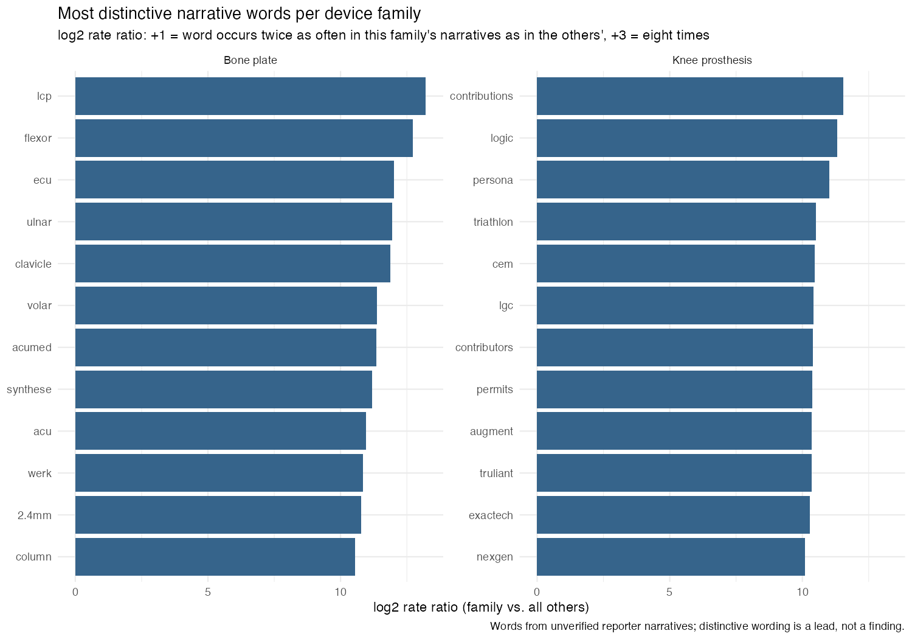
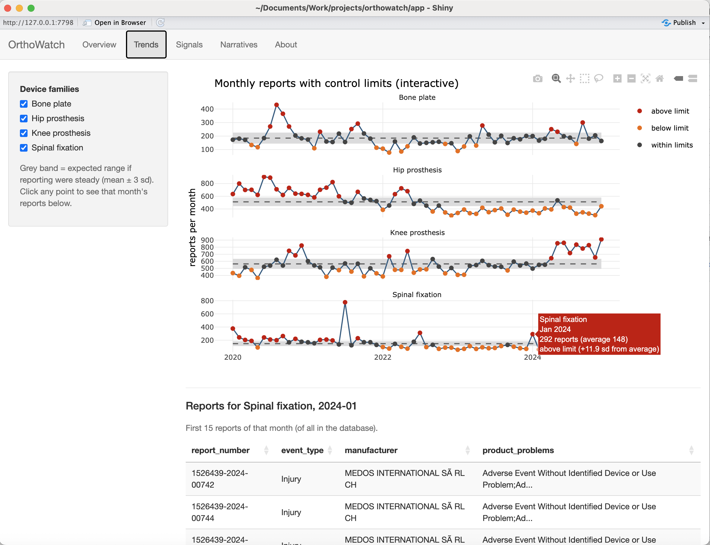
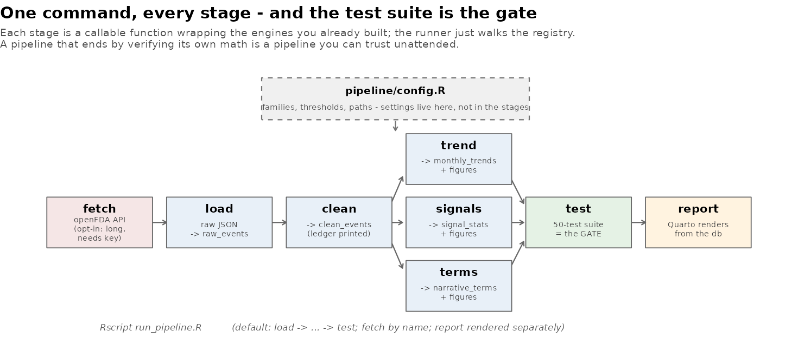
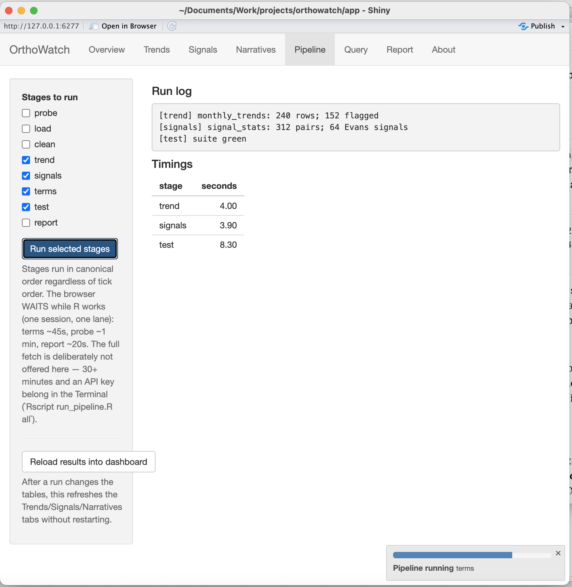
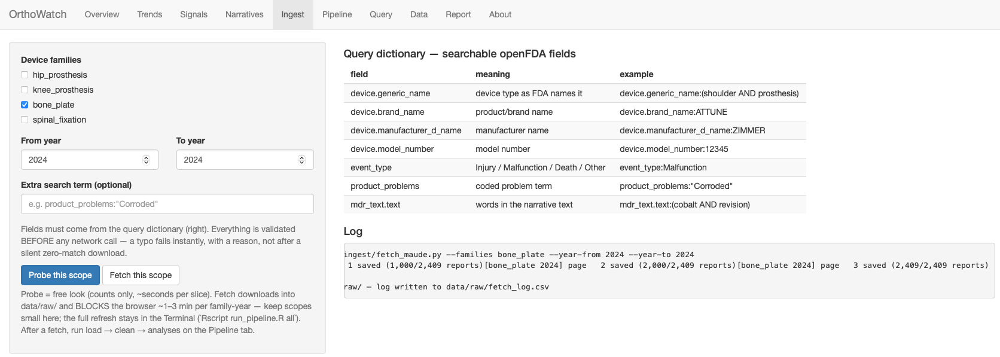
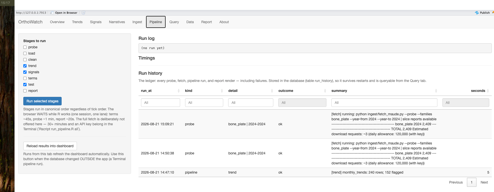
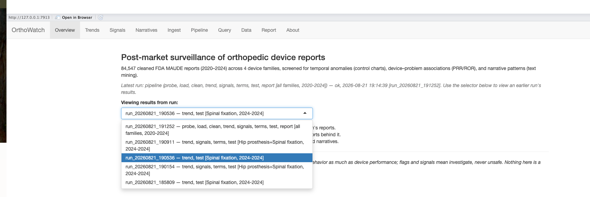

# OrthoWatch 🦴📊


**Watching how orthopedic implants behave in the real world, using the
FDA's public reports of things going wrong — built from scratch, in
public, fully explained.**

> Every term used anywhere in this repo — medical or technical — is
> defined in plain language in [`docs/GLOSSARY.md`](docs/GLOSSARY.md).
> If a word isn't there, that's a documentation bug.

---

## Contents

- [What is an adverse event? (start here)](#what-is-an-adverse-event-start-here)
- [The problem this project tackles](#the-problem-this-project-tackles)
- [How it works](#how-it-works)
- [Results, phase by phase](#the-data-at-a-glance) — tables, charts, the
  dashboard, the pipeline, and every finding, with figures
- [Build log](#build-log) — every phase, linked to its guide
- [**The tutorial, in order**](#the-tutorial-in-order) — the 12
  documents that teach every step from a blank laptop
- [Bumps hit along the way](#bumps-hit-along-the-way-kept-on-purpose) —
  real mistakes, kept and explained
- [About the data (honesty notes)](#about-the-data-honesty-notes)
- [Repository map](#repository-map)
- [How to run](#how-to-run)

## What is an adverse event? (start here)

Imagine a patient whose hip implant starts loosening two years after
surgery. There's pain, a hospital visit, and eventually a second
operation to replace the implant. The hospital — or the implant's
manufacturer — is required to file a form about it with the **FDA**
(the US agency overseeing medical devices).

That incident is an **adverse event**: *any harm or malfunction
involving a medical device* — it broke, wore out, came loose, caused
injury or infection. The form describing it is an **adverse event
report**: which device, what happened, when, and a short written
account. The FDA collects millions of these forms in a public database
called **MAUDE**, and anyone may download them.

One event = one bad incident. One report = one form about it. One row
in this project's data = one report.

## The problem this project tackles

**The pain point.** Device manufacturers are legally required to watch
those reports for warning signs — one implant model suddenly
generating far more "it broke" forms than usual. But the raw material
fights back:

- **Volume:** even this project's narrow slice — orthopedic implants,
  five years — is **84,549 reports**. No human reads that.
- **Mess:** the same device is spelled many ways. Real examples from
  this dataset, all naming overlapping concepts:
  `PLATE, BONE` · `PLATE,FIXATION,BONE` · `PLATE, FIXATION, BONE`.
  Dates are stored as text. Some fields are blank. Some forms are
  duplicates.
- **Buried meaning:** the most important information is often in the
  free-text story on the form, not in any tidy field.

Teams solve this with surveillance software that counts, charts, and
flags — but such systems are mostly proprietary and invisible, and
public, fully-explained examples for orthopedics barely exist.

**Why it matters.** Signals caught early mean investigations start
earlier, problems are corrected sooner, and fewer patients are harmed.
The history of orthopedic implants includes painful, large-scale
recalls where earlier pattern-detection would have spared real people
real harm. The methods are not secret — they deserve a public,
learnable implementation.

**What OrthoWatch is.** An end-to-end, open post-market surveillance
workflow on real FDA data: a Python script downloads the orthopedic
reports; R code cleans the notorious mess and sorts every report into
device families; statistical methods used in real device vigilance
(trending with control limits, disproportionality analysis) flag
device–problem combinations reporting above expectation; text mining
surfaces failure modes from the written narratives; and an interactive
dashboard plus a self-updating report present the results. Every step
is documented so a complete beginner can rebuild and understand all of
it — the repository is the tutorial.

## How it works



In words: download the forms exactly as the FDA provides them and
never edit that copy; build a tidied second copy; run the counting,
charting, and flagging on the tidy copy; show the results two ways —
a dashboard for exploring and a report for the record.

## The data at a glance

*(from this project's August 2026 download; MAUDE updates weekly, so
your numbers will differ slightly)*

| Fact | Value |
|---|---|
| Reports downloaded | **84,549** |
| Period covered | January 2020 – December 2024 |
| Device families | Hip prostheses, knee prostheses, bone plates, spinal fixation |
| Reports describing an injury | ~74% |
| Reports describing a death | 129 |
| Distinct raw device-name spellings | hundreds — collapsed to 5 families by the cleaning step |

**Results so far, phase by phase** — each phase leaves a visible
artifact; here is one per phase, with what it means.

### Phase 2 — Cleaning: 912 spellings become 5 families

The raw downloads spell the same devices 912 different ways
(`PLATE, BONE` / `PLATE,FIXATION,BONE` / `BONE PLATE`, ...). The
cleaning step normalizes formatting and sorts every report into an
analyzable device family — with a printed ledger so no row vanishes
silently (84,549 in, 84,547 out: exactly the two follow-up duplicate
forms, no more):

| Device family | Reports |
|---|---|
| Knee prosthesis | 33,834 |
| Hip prosthesis | 30,754 |
| Bone plate | 11,097 |
| Spinal fixation | 8,852 |
| Other (screws, cement, etc.) | 10 |

### Phase 3 — Trending: when did reporting move?

Monthly reports per family with 3-sigma control limits (grey band =
the expected range if reporting were steady; red dots = months
flagged for investigation, orange = unusually few):



▶ [Trends, interactive](https://akannan2987.github.io/orthowatch/interactive/trend_by_family.html)
— hover any point for its exact numbers; drag to zoom.

Two findings worth clicking into: a five-fold, single-month tower in
spinal fixation reports (July 2021, +51.7 standard deviations — the
classic silhouette of a batch submission) and the mid-2020 bone-plate
surge, which per-month analysis shows concentrated in one reporter
and in the *unspecified* problem category — a reporting-behavior
pattern, not evidence any device got worse. Flags mean
*investigate*, never *unsafe*.

### Phase 4 — Signal detection: which problems belong to which devices?

Trending says *when*; disproportionality analysis asks the sharper
question: is a problem over-represented among one family's reports,
measured against that family's own report total? Each family's
strongest signals, all passing the published Evans rule (PRR ≥ 2,
χ² ≥ 4, at least 3 reports); dot = reporting odds ratio, whiskers =
95% confidence interval, dashed line = "reported no more than
everyone else":



▶ [Signals, interactive](https://akannan2987.github.io/orthowatch/interactive/signals_top.html)
— hover for the full problem name, the 2×2 counts, and the
confidence interval.

64 device–problem pairs signal, and they cohere clinically: a
metal-degradation cluster for hips (Corroded, Material Erosion,
Biocompatibility), slippage and material integrity for spinal
fixation, wear and instability for knees, an intraoperative-fit
cluster for bone plates. The method also validates itself: the
dataset's biggest problem category (26,093 vague "unidentified
problem" mentions) signals for **no** family — exactly as a category
present everywhere should. All 2×2 arithmetic is guarded by the
project's test suite. Over-reported ≠ over-occurring: signals open
investigations, never close them.

### Phase 5 — Text mining: the narratives speak

The categorical fields are the tip of each report; the free-text
narrative is the substance. After tokenizing ~84K stories (12.2
million words) and stripping filler, each family's *distinctive
vocabulary* (word rate in the family vs. everyone else, log2 scale —
Phase 4's arithmetic applied to words):



▶ [Vocabulary scatter, interactive](https://akannan2987.github.io/orthowatch/interactive/narrative_terms.html)
— every dot a word; hover for its rates and ratio. Dots far below
the diagonal are that family's own vocabulary.

Two things the text found that the codes hid: the "bone plate" family
contains a whole craniofacial/mandibular plating subgroup (mandible,
retrognathia, sternal, resorbable-plate brands), and the spinal
"no apparent adverse event" signal from Phase 4 turned out to be one
reporter's standard legal-disclaimer template — a reporting pattern,
confirmed by actually reading sampled narratives, not a device
pattern. The hip narratives' top term is the name of a metal-on-metal
resurfacing device class — the text-side counterpart of Phase 4's
metal-degradation signals. Narrative words are leads from unverified
reporter text, never findings about devices.

### Phase 6 — The dashboard: from artifacts to instrument

The three interactive charts and five database tables assemble into
a Shiny app — the same tested functions, now with what static pages
can't do: click any flagged month, signal, or word and the app
queries the database live for the reports behind it (parameterized
SQL, guarded reactivity, 42 tests). Below: a +11.9-sigma spinal
month, hovered, clicked, and answered.



The app runs locally (`shiny::runApp("app")`) — a live R server per
user is exactly what GitHub Pages can't host, which is why the
published charts above are static-interactive and the dashboard is a
picture. Deployment (e.g. shinyapps.io) is a documented roadmap
item.

### Phase 7 — Reproducibility, demonstrated

Every stage — fetch, load, clean, trend, signals, terms — is now a
config-driven callable function, and one command runs the lot in
canonical order with the 50-test suite as the final gate:

```
Rscript run_pipeline.R
```



And because stakeholders read reports, not databases: an executable
Quarto report re-tells the whole analysis — every number and figure
computed from the database at render time, never pasted — published
here:
**[▶ The OrthoWatch report](https://akannan2987.github.io/orthowatch/orthowatch_report.html)**
(one self-contained page: the data, the three analyses, the honest
caveats, and how the report made itself).

### Phase 8 — Mission Control: the app becomes a workbench

The dashboard grows three tabs and becomes the full instrument:
**Pipeline** (tick stages, press Run — the same tested stage
functions, with live log and timings), **Query** (a SQL console
that is read-only *by construction*: a tested validator AND a
read-only connection — two independent locks), and **Report**
(render + publish on a button). The UI wraps the pipeline — no
logic moved, none duplicated; 63 tests.



The long fetch deliberately stays in the Terminal (a 30-minute
credentialed download doesn't belong behind a button that freezes a
browser), and true background execution is the named roadmap item —
design decisions documented, not hidden.

### Phase 8b — Scoped ingestion & full data access

The intake gets a steering wheel and the data gets doors: an
**Ingest** tab where the user picks families, years, and an optional
extra search term — validated against a **query dictionary** of the
API's searchable fields *before any network call* (typos fail
instantly, with reasons) — probes the scope for free, then fetches
it; and a **Data** tab that browses every table with per-column
filters and sorting, and exports any table (CSV / Excel / JSON),
any figure, and the report, at full fidelity. One scope definition
travels UI → config → CLI → API; a `--dry-run` flag prints what any
scope resolves to without touching the network. 72 tests.



### Phase 8c — The instrument gets a memory

Every consequential event — probe, fetch, pipeline run, report
render — now writes one line to a **run-history ledger** in the
database itself (failures included: an honest ledger keeps its bad
days). The Overview tab carries a **provenance line** naming the run
behind the results on screen, the Pipeline tab shows the full
history (restart-proof, and queryable from the Query tab, because
the ledger is just another table), and successful runs **refresh the
dashboard automatically**. State and ledger: what things are, and
how they got that way. 79 tests.



### Phase 8d — Runs become first-class citizens

The final construction: **versioned result sets**. Each pipeline run
appends its results to the three analysis tables labeled with its
run id — one table, many vintages, nothing silently overwritten
again — with in-place migration (existing rows become the `legacy`
vintage), idempotent per-run writes, and a retention policy. A
**run selector** on the Overview switches the entire dashboard to
any kept vintage; `run_history` joins the Data tab's exportable
tables; every Query-tab result gains CSV/Excel downloads. An **Analysis
scope** panel on the Pipeline tab sets what each run *computes over*
(families × years) — a scoped run's vintage contains exactly its
slice, the selector labels every run with its scope, and the chart
controls follow the chosen vintage. The event tables deliberately
stay unversioned (documented trade-off: drill-downs always query
current events). 92 tests.



## Build log

| # | Document | Status |
|---|---|---|
| — | [Glossary — every term in plain words](docs/GLOSSARY.md) | ✅ living document |
| 0 | [Architecture — how it all fits together](docs/00-architecture.md) | ✅ |
| 0 | [Environment setup from a blank laptop](docs/01-setup.md) | ✅ |
| 1 | [Ingestion: FDA API → local database](docs/02-phase-1-ingestion.md) | ✅ |
| 2 | [Cleaning & harmonization](docs/03-phase-2-cleaning.md) | ✅ |
| 3 | [Complaint trending](docs/04-phase-3-trending.md) | ✅ |
| 4 | [Signal detection + automated tests](docs/05-phase-4-signal-detection.md) | ✅ |
| 5 | [Text mining the narratives](docs/06-phase-5-text-mining.md) | ✅ |
| 6 | [Interactive dashboard (Shiny)](docs/07-phase-6-shiny-dashboard.md) | ✅ |
| 7 | [Reproducible report & one-command pipeline](docs/08-phase-7-pipeline-report.md) | ✅ |
| 8 | [Mission Control — the app suite](docs/09-phase-8-mission-control.md) | ✅ |
| 8b | [Scoped ingestion & data access](docs/10-phase-8b-scoped-ingestion-data-access.md) | ✅ |
| 8c | [Provenance & run history](docs/11-phase-8c-provenance-run-history.md) | ✅ |
| 8d | [Versioned results & run selector](docs/12-phase-8d-versioned-results.md) | ✅ |
| 9 | Polish & release notes | planned |

## The tutorial, in order

Every step of this project — from an empty laptop to the workbench —
is taught in `docs/`, written for a complete beginner, with every
term defined ([glossary](docs/GLOSSARY.md)) and every command shown
with its expected output. Read in order:

| # | Guide | What it teaches |
|---|---|---|
| 00 | [Architecture](docs/00-architecture.md) | How all the pieces fit together |
| 01 | [Setup](docs/01-setup.md) | Blank laptop → working workshop (R, Python, Git, the verification habit) |
| 02 | [Phase 1 — Ingestion](docs/02-phase-1-ingestion.md) | APIs, paging, retries; real FDA data lands |
| 03 | [Phase 2 — Cleaning](docs/03-phase-2-cleaning.md) | Dates, dedup, device families; the cleaning ledger |
| 04 | [Phase 3 — Trending](docs/04-phase-3-trending.md) | Control charts; interactive charts; GitHub Pages |
| 05 | [Phase 4 — Signal detection](docs/05-phase-4-signal-detection.md) | 2×2 tables, PRR/ROR, the Evans rule; automated tests |
| 06 | [Phase 5 — Text mining](docs/06-phase-5-text-mining.md) | Tokens, stop words, distinctive vocabulary; reading missions |
| 07 | [Phase 6 — The dashboard](docs/07-phase-6-shiny-dashboard.md) | Shiny, reactivity, click drill-downs |
| 08 | [Phase 7 — Pipeline & report](docs/08-phase-7-pipeline-report.md) | Config-driven stages, the test gate, the executable report |
| 09 | [Phase 8 — Mission Control](docs/09-phase-8-mission-control.md) | The workbench: run stages, query read-only, render on demand |
| 10 | [Phase 8b — Scoped ingestion & data access](docs/10-phase-8b-scoped-ingestion-data-access.md) | Query dictionary, validate-before-network, exports |
| — | [Glossary](docs/GLOSSARY.md) | Every term, plain language, by phase |

## Bumps hit along the way (kept on purpose)

Real data fights back. Three fights so far, each documented in the
Phase 1 guide's troubleshooting section:

- **The FDA writes device names backwards.** A hip implant is recorded
  as `PROSTHESIS, HIP` — not "hip prosthesis" — so the first version
  of the download search quietly found almost nothing. The script now
  searches for words in any order, and always asks "how many reports
  would this search find?" *before* downloading, so implausible
  numbers get caught early.
- **The FDA's data service has a security guard.** Automated defenses
  refuse traffic that looks like an anonymous robot (the web's code
  for "access denied" is 403 — exactly the error the first download
  hit). The script now identifies itself by name on every request,
  uses a free registered access key, and waits-and-retries politely
  when refused.
- **A silent edit-miss made a promise the code didn't keep.** The
  scoped-fetch feature was supposed to tag its files (`_q`) so they
  could never collide with the main dataset's pages — the dry-run
  even printed the tagged pattern. But the automated edit that was
  meant to add the tag to the *save path* targeted a variable name
  that didn't quite match, silently changed nothing, and a scoped
  1-report fetch overwrote a 1,000-report page file. The pipeline's
  printed counts caught it within one run (84,549 became 83,550 for
  no stated reason), and the Query console's per-file counts located
  the casualty. Lessons kept: numbers that move without a reason are
  an alarm, not noise; and automated edits must be verified
  *per-change*, against the artifact — a "something changed" check
  is not verification.
- **A scoped fetch silently overwrote a full page file.** The
  extra-search fetch was meant to write tag-marked files alongside
  the originals; on one machine the tag never reached the filename,
  and a 1-report download replaced a 1,000-report page. The
  pipeline's printed counts caught it on the next run (84,549 became
  83,550 — numbers that move without a reason are the alarm), and
  the Query console's per-source-file counts located the wound.
  Fixes kept: page-file names now come from ONE function used by
  both the writer and the dry-run (claims derived, never asserted
  beside the code), and a runtime self-check makes any future tag
  failure a loud error instead of a silent clobber.
- **An interrupted handler stranded R's working directory.** The
  app briefly changes directory to run pipeline stages; a fetch that
  errored out mid-handler left the session parked inside `app/`, and
  the next `runApp("app")` failed with "No Shiny application exists"
  — a confusing symptom two steps removed from its cause. Lesson
  kept (and applied at all three sites): register the cleanup
  *before* the risky action — `on.exit(restore)` first, `setwd()`
  second — so no error path can leave the mess behind.
- **A test fixture drifted from the real schema.** The dashboard's
  month drill-down was validated headlessly against a synthetic
  database — built from memory, with a `date_received` column the
  real cleaned table doesn't have (cleaning stores the derived
  `year_month` instead). The test passed; the first real click
  failed. Lesson kept: fixtures must be built from the same code or
  schema as production, never from recollection.
- **Arithmetic can silently overflow.** R stores counts as 32-bit
  integers (max ≈ 2.1 billion); the chi-square denominator multiplies
  four of them straight past that ceiling into NA. The project's unit
  tests — every expectation first worked out by hand — refused to
  pass, catching the bug before the code ever met real data. The
  one-line fix and the story live in the signal-detection engine.
- **Some forms have empty slots in the middle of their lists.** A
  report's list of problems can contain a literal nothing between
  real entries, which crashed the first version of the loader. The
  loader now skips empty entries instead of trusting every field to
  be filled in.

## About the data (honesty notes)

- Source: the [openFDA device event API](https://open.fda.gov/apis/device/event/)
  — the FDA's free data service for MAUDE reports, updated weekly. A
  free access key ([get one here](https://open.fda.gov/apis/authentication/))
  is effectively required for bulk downloading; the setup guide
  covers storing it safely outside the repo.
- The FDA itself cautions that these reports are unverified, that
  some incidents are never reported while others are reported
  repeatedly, and that **report counts are not failure rates**. This
  project finds *patterns worth investigating* — exactly how real
  surveillance treats this data. It does not and cannot conclude that
  any real product is unsafe.
- The data service caps how far one search can page through results
  (~26,000 reports per query); the fetch log records honestly
  whenever a slice was cut off at that ceiling.
- MAUDE is also *revised in place* — observed directly, twice over,
  in this project: one slice re-fetched *days* after the original
  came back with identical report counts but amended narrative text
  (37 rows of the vocabulary table shifted — the FDA had edited
  prose while every total stayed fixed), while a full re-fetch of
  the entire scope run *hours* after its baseline was byte-for-byte
  identical across all 95 files. Revision happens on a scale of
  days, not hours; frozen raw snapshots plus a pipeline that prints
  its counts is how drift that subtle gets noticed at all.
- In 2026 the FDA began consolidating MAUDE into a newer system
  (AEMS); the data service is expected to remain compatible.

## Repository map

The full tree, annotated with the phase that creates each file. When a
tutorial phase hands you a new file, this is where it goes:

```
orthowatch/
├── README.md                      ← you are here
├── .gitignore                     ← files Git must ignore (setup)
├── .Rprofile                      ← created by renv; activates it (setup)
├── orthowatch.Rproj               ← marks this folder as an RStudio project
├── renv.lock                      ← exact R package versions (setup)
├── renv/                          ← R's sealed package toolbox (setup)
├── .venv/                         ← Python's sealed toolbox — NOT in Git
│
├── docs/                          ← the tutorials: read these in order
│   ├── GLOSSARY.md                ← every term, plain language
│   ├── 00-architecture.md         ← how it all fits together
│   ├── 01-setup.md                ← blank laptop → working workshop
│   ├── 02-phase-1-ingestion.md    ← Phase 1 guide
│   ├── 03-phase-2-cleaning.md     ← Phase 2 guide
│   ├── 04-phase-3-trending.md     ← Phase 3 guide
│   ├── img/                       ← teaching figures (synthetic data)
│   │   ├── make_illustrations.R   ← regenerates the four PNGs below
│   │   ├── time_series_anatomy.png
│   │   ├── absent_vs_zero.png
│   │   ├── sqrt_rule.png
│   │   └── control_chart_anatomy.png
│   ├── interactive/               ← published interactive charts, served
│   │   ├── trend_by_family.html      as web pages by GitHub Pages (Phase 3)
│   │   ├── signals_top.html          (Phase 4)
│   │   └── narrative_terms.html      (Phase 5)
│   └── .nojekyll                  ← tells Pages: serve files as-is
│   (docs/ also gains 05-phase-4-signal-detection.md and
│    img/contingency_2x2.png in Phase 4)
│
├── run_pipeline.R                 ← the whole project, one command (Phase 7)
├── pipeline/                      ← the assembly line (Phase 7)
│   ├── config.R                   ← the settings panel — one place
│   └── stages.R                   ← every stage as a callable function
│
├── ingest/                        ← Python: getting the data (Phase 1)
│   ├── requirements.txt           ← exact Python package versions
│   ├── fetch_maude.py             ← FDA API → data/raw/ (scoped CLI:
│   │                                --families --year-from/-to --search,
│   │                                query dictionary, --dry-run; Phase 8b)
│   └── load_to_sqlite.py          ← data/raw/ → the database
│
├── R/                             ← the engine: reusable, tested functions
│   ├── clean_events.R             ← cleaning rules (Phase 2)
│   ├── console.R                  ← read-only query engine (Phase 8)
│   ├── run_history.R              ← the ledger + versioned vintages
│   │                                (record/read runs, Phase 8c;
│   │                                 write_versioned/read_result, Phase 8d)
│   ├── trending.R                 ← control-limit trending (Phase 3)
│   ├── signal_detection.R         ← PRR/ROR disproportionality (Phase 4)
│   └── text_mining.R              ← narrative tokenization + term stats (Phase 5)
│
├── analysis/                      ← narratives: scripts run line by line
│   ├── 00_verify_ingest.R         ← Phase 1 checkpoint
│   ├── 01_clean_events.R          ← Phase 2 walkthrough
│   ├── 02_trending.R              ← Phase 3 walkthrough
│   ├── 03_signal_detection.R      ← Phase 4 walkthrough
│   └── 04_text_mining.R           ← Phase 5 walkthrough
│
├── data/                          ← NOT in Git; regenerated by scripts
│   ├── raw/                       ← untouched FDA downloads + fetch_log.csv
│   └── processed/                 ← orthowatch.db (the SQLite database)
│
├── figures/                       ← real-data charts (created in Phase 3;
│                                    PNGs committed — the README's screenshots;
│                                    interactive *.html previews NOT in Git)
├── tests/                         ← automated checks (Phase 4)
│   ├── run_tests.R                ← one command runs the whole suite
│   └── testthat/
│       ├── test-console.R
│       ├── test-interactive_meta.R
│       ├── test-pipeline.R
│       ├── test-run_history.R
│       ├── test-signal_detection.R
│       ├── test-text_mining.R
│       └── test-trending.R
├── app/                           ← the Shiny dashboard (Phase 6)
│   └── app.R                      ← UI + server, one commented file
│                                    run: shiny::runApp("app")
└── report/                        ← the executable report (Phase 7)
    └── orthowatch_report.qmd      ← renders from the db; published
                                     copy lives at docs/orthowatch_report.html
```

Two kinds of "empty": remaining placeholder folders hold only a
placeholder until their phase arrives; `data/` fills up on your machine
but stays out of Git on purpose (the pipeline regenerates it — that's
the proof it works). And two kinds of figures: `docs/img/` = synthetic
teaching illustrations; `figures/` = charts computed from the real data.

| Path | What lives here |
|---|---|
| `docs/` | Numbered beginner-level tutorials for every phase, plus the [glossary](docs/GLOSSARY.md) |
| `ingest/` | Python scripts that download FDA reports into the database |
| `R/` | Reusable R functions — the tested "engine" (cleaning, trending, detection) |
| `analysis/` | Exploratory R scripts, meant to be run line by line |
| `app/` | The interactive dashboard (later phase) |
| `report/` | The self-updating written report (later phase) |
| `tests/` | Automated checks that the engine functions do what they claim |
| `data/` | Raw and processed data — **not stored in Git**; regenerated by the scripts |

## How to run

Start at [`docs/01-setup.md`](docs/01-setup.md) — it assumes a
completely blank machine and explains every step, then hands off to
the Phase 1 guide. The short version, once set up:

```bash
python ingest/fetch_maude.py --probe   # see how many reports are available
python ingest/fetch_maude.py           # download them
python ingest/load_to_sqlite.py        # build the local database
```

## Why the documentation is so detailed

Documentation quality is a deliberate deliverable here, not an
afterthought. In regulated industries an analysis that cannot be
reproduced and explained is worthless — so this repo is written so
that a complete beginner can rebuild it from scratch and learn every
concept along the way. The glossary rule at the top is part of that
contract.
