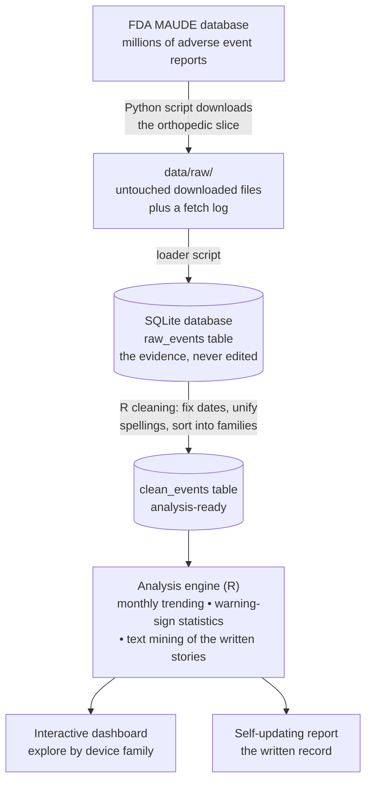

# OrthoWatch 🦴📊


**Watching how orthopedic implants behave in the real world, using the
FDA's public reports of things going wrong — built from scratch, in
public, fully explained.**

> Every term used anywhere in this repo — medical or technical — is
> defined in plain language in [`docs/GLOSSARY.md`](docs/GLOSSARY.md).
> If a word isn't there, that's a documentation bug.

---

## What is an adverse event? (start here)

Imagine a patient whose hip implant starts loosening two years after
surgery. There's pain, a hospital visit, and eventually a second
operation to replace the implant. The hospital — or the implant's
manufacturer — is required to file a form about it with the **FDA**
(the US agency overseeing medical devices).

That incident is an **adverse event**: *any harm or malfunction
involving a medical device* — it broke, wore out, came loose, caused
injury or infection. The form describing it is an **adverse event
report**: which device, what happened, when, and a short written
account. The FDA collects millions of these forms in a public database
called **MAUDE**, and anyone may download them.

One event = one bad incident. One report = one form about it. One row
in this project's data = one report.

## The problem this project tackles

**The pain point.** Device manufacturers are legally required to watch
those reports for warning signs — one implant model suddenly
generating far more "it broke" forms than usual. But the raw material
fights back:

- **Volume:** even this project's narrow slice — orthopedic implants,
  five years — is **84,549 reports**. No human reads that.
- **Mess:** the same device is spelled many ways. Real examples from
  this dataset, all naming overlapping concepts:
  `PLATE, BONE` · `PLATE,FIXATION,BONE` · `PLATE, FIXATION, BONE`.
  Dates are stored as text. Some fields are blank. Some forms are
  duplicates.
- **Buried meaning:** the most important information is often in the
  free-text story on the form, not in any tidy field.

Teams solve this with surveillance software that counts, charts, and
flags — but such systems are mostly proprietary and invisible, and
public, fully-explained examples for orthopedics barely exist.

**Why it matters.** Signals caught early mean investigations start
earlier, problems are corrected sooner, and fewer patients are harmed.
The history of orthopedic implants includes painful, large-scale
recalls where earlier pattern-detection would have spared real people
real harm. The methods are not secret — they deserve a public,
learnable implementation.

**What OrthoWatch is.** An end-to-end, open post-market surveillance
workflow on real FDA data: a Python script downloads the orthopedic
reports; R code cleans the notorious mess and sorts every report into
device families; statistical methods used in real device vigilance
(trending with control limits, disproportionality analysis) flag
device–problem combinations reporting above expectation; text mining
surfaces failure modes from the written narratives; and an interactive
dashboard plus a self-updating report present the results. Every step
is documented so a complete beginner can rebuild and understand all of
it — the repository is the tutorial.

## How it works



In words: download the forms exactly as the FDA provides them and
never edit that copy; build a tidied second copy; run the counting,
charting, and flagging on the tidy copy; show the results two ways —
a dashboard for exploring and a report for the record.

## The data at a glance

*(from this project's August 2026 download; MAUDE updates weekly, so
your numbers will differ slightly)*

| Fact | Value |
|---|---|
| Reports downloaded | **84,549** |
| Period covered | January 2020 – December 2024 |
| Device families | Hip prostheses, knee prostheses, bone plates, spinal fixation |
| Reports describing an injury | ~74% |
| Reports describing a death | 129 |
| Distinct raw device-name spellings | hundreds — collapsed to 5 families by the cleaning step |

**Screenshots** — coming with the dashboard phase; this section will
show the trending views and a before/after of the device-name cleanup.

## Build log

| # | Document | Status |
|---|---|---|
| — | [Glossary — every term in plain words](docs/GLOSSARY.md) | ✅ living document |
| 0 | [Architecture — how it all fits together](docs/00-architecture.md) | ✅ |
| 1 | [Environment setup from a blank laptop](docs/01-setup.md) | ✅ |
| 2 | [Ingestion: FDA API → local database](docs/02-phase-1-ingestion.md) | ✅ |
| 3 | [Cleaning & harmonization](docs/03-phase-2-cleaning.md) | ✅ |
| 4 | Complaint trending | planned |
| 5 | Signal detection + automated tests | planned |
| 6 | Text mining the narratives | planned |
| 7 | Interactive dashboard (Shiny) | planned |
| 8 | Reproducible report & one-command pipeline | planned |
| 9 | Polish & release notes | planned |

## Bumps hit along the way (kept on purpose)

Real data fights back. Three fights so far, each documented in the
Phase 1 guide's troubleshooting section:

- **The FDA writes device names backwards.** A hip implant is recorded
  as `PROSTHESIS, HIP` — not "hip prosthesis" — so the first version
  of the download search quietly found almost nothing. The script now
  searches for words in any order, and always asks "how many reports
  would this search find?" *before* downloading, so implausible
  numbers get caught early.
- **The FDA's data service has a security guard.** Automated defenses
  refuse traffic that looks like an anonymous robot (the web's code
  for "access denied" is 403 — exactly the error the first download
  hit). The script now identifies itself by name on every request,
  uses a free registered access key, and waits-and-retries politely
  when refused.
- **Some forms have empty slots in the middle of their lists.** A
  report's list of problems can contain a literal nothing between
  real entries, which crashed the first version of the loader. The
  loader now skips empty entries instead of trusting every field to
  be filled in.

## About the data (honesty notes)

- Source: the [openFDA device event API](https://open.fda.gov/apis/device/event/)
  — the FDA's free data service for MAUDE reports, updated weekly. A
  free access key ([get one here](https://open.fda.gov/apis/authentication/))
  is effectively required for bulk downloading; the setup guide
  covers storing it safely outside the repo.
- The FDA itself cautions that these reports are unverified, that
  some incidents are never reported while others are reported
  repeatedly, and that **report counts are not failure rates**. This
  project finds *patterns worth investigating* — exactly how real
  surveillance treats this data. It does not and cannot conclude that
  any real product is unsafe.
- The data service caps how far one search can page through results
  (~26,000 reports per query); the fetch log records honestly
  whenever a slice was cut off at that ceiling.
- In 2026 the FDA began consolidating MAUDE into a newer system
  (AEMS); the data service is expected to remain compatible.

## Repository map

| Path | What lives here |
|---|---|
| `docs/` | Numbered beginner-level tutorials for every phase, plus the [glossary](docs/GLOSSARY.md) |
| `ingest/` | Python scripts that download FDA reports into the database |
| `R/` | Reusable R functions — the tested "engine" (cleaning, trending, detection) |
| `analysis/` | Exploratory R scripts, meant to be run line by line |
| `app/` | The interactive dashboard (later phase) |
| `report/` | The self-updating written report (later phase) |
| `tests/` | Automated checks that the engine functions do what they claim |
| `data/` | Raw and processed data — **not stored in Git**; regenerated by the scripts |

## How to run

Start at [`docs/01-setup.md`](docs/01-setup.md) — it assumes a
completely blank machine and explains every step, then hands off to
the Phase 1 guide. The short version, once set up:

```bash
python ingest/fetch_maude.py --probe   # see how many reports are available
python ingest/fetch_maude.py           # download them
python ingest/load_to_sqlite.py        # build the local database
```

## Why the documentation is so detailed

Documentation quality is a deliberate deliverable here, not an
afterthought. In regulated industries an analysis that cannot be
reproduced and explained is worthless — so this repo is written so
that a complete beginner can rebuild it from scratch and learn every
concept along the way. The glossary rule at the top is part of that
contract.
