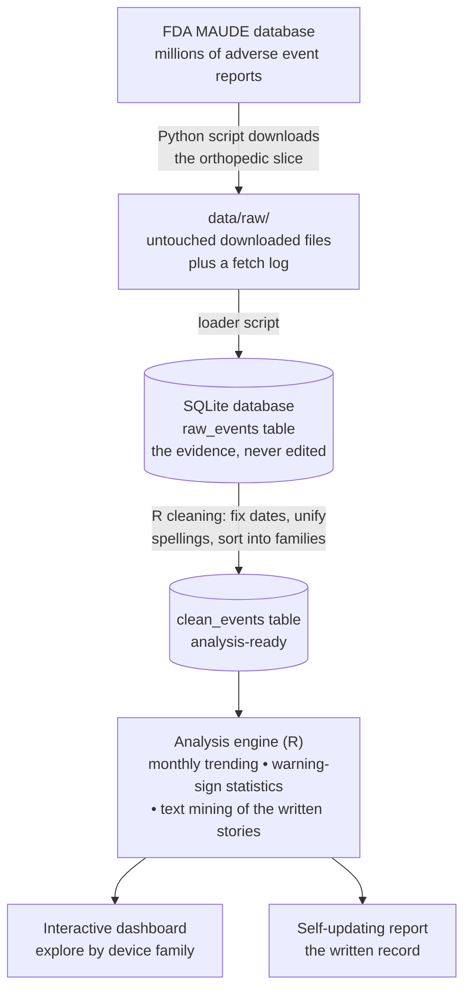

# OrthoWatch 🦴📊


**Watching how orthopedic implants behave in the real world, using the
FDA's public reports of things going wrong — built from scratch, in
public, fully explained.**

> Every term used anywhere in this repo — medical or technical — is
> defined in plain language in [`docs/GLOSSARY.md`](docs/GLOSSARY.md).
> If a word isn't there, that's a documentation bug.

---

## What is an adverse event? (start here)

Imagine a patient whose hip implant starts loosening two years after
surgery. There's pain, a hospital visit, and eventually a second
operation to replace the implant. The hospital — or the implant's
manufacturer — is required to file a form about it with the **FDA**
(the US agency overseeing medical devices).

That incident is an **adverse event**: *any harm or malfunction
involving a medical device* — it broke, wore out, came loose, caused
injury or infection. The form describing it is an **adverse event
report**: which device, what happened, when, and a short written
account. The FDA collects millions of these forms in a public database
called **MAUDE**, and anyone may download them.

One event = one bad incident. One report = one form about it. One row
in this project's data = one report.

## The problem this project tackles

**The pain point.** Device manufacturers are legally required to watch
those reports for warning signs — one implant model suddenly
generating far more "it broke" forms than usual. But the raw material
fights back:

- **Volume:** even this project's narrow slice — orthopedic implants,
  five years — is **84,549 reports**. No human reads that.
- **Mess:** the same device is spelled many ways. Real examples from
  this dataset, all naming overlapping concepts:
  `PLATE, BONE` · `PLATE,FIXATION,BONE` · `PLATE, FIXATION, BONE`.
  Dates are stored as text. Some fields are blank. Some forms are
  duplicates.
- **Buried meaning:** the most important information is often in the
  free-text story on the form, not in any tidy field.

Teams solve this with surveillance software that counts, charts, and
flags — but such systems are mostly proprietary and invisible, and
public, fully-explained examples for orthopedics barely exist.

**Why it matters.** Signals caught early mean investigations start
earlier, problems are corrected sooner, and fewer patients are harmed.
The history of orthopedic implants includes painful, large-scale
recalls where earlier pattern-detection would have spared real people
real harm. The methods are not secret — they deserve a public,
learnable implementation.

**What OrthoWatch is.** An end-to-end, open post-market surveillance
workflow on real FDA data: a Python script downloads the orthopedic
reports; R code cleans the notorious mess and sorts every report into
device families; statistical methods used in real device vigilance
(trending with control limits, disproportionality analysis) flag
device–problem combinations reporting above expectation; text mining
surfaces failure modes from the written narratives; and an interactive
dashboard plus a self-updating report present the results. Every step
is documented so a complete beginner can rebuild and understand all of
it — the repository is the tutorial.

## How it works



In words: download the forms exactly as the FDA provides them and
never edit that copy; build a tidied second copy; run the counting,
charting, and flagging on the tidy copy; show the results two ways —
a dashboard for exploring and a report for the record.

## The data at a glance

*(from this project's August 2026 download; MAUDE updates weekly, so
your numbers will differ slightly)*

| Fact | Value |
|---|---|
| Reports downloaded | **84,549** |
| Period covered | January 2020 – December 2024 |
| Device families | Hip prostheses, knee prostheses, bone plates, spinal fixation |
| Reports describing an injury | ~74% |
| Reports describing a death | 129 |
| Distinct raw device-name spellings | hundreds — collapsed to 5 families by the cleaning step |

**Results so far, phase by phase** — each phase leaves a visible
artifact; here is one per phase, with what it means.

### Phase 2 — Cleaning: 912 spellings become 5 families

The raw downloads spell the same devices 912 different ways
(`PLATE, BONE` / `PLATE,FIXATION,BONE` / `BONE PLATE`, ...). The
cleaning step normalizes formatting and sorts every report into an
analyzable device family — with a printed ledger so no row vanishes
silently (84,549 in, 84,547 out: exactly the two follow-up duplicate
forms, no more):

| Device family | Reports |
|---|---|
| Knee prosthesis | 33,834 |
| Hip prosthesis | 30,754 |
| Bone plate | 11,097 |
| Spinal fixation | 8,852 |
| Other (screws, cement, etc.) | 10 |

### Phase 3 — Trending: when did reporting move?

Monthly reports per family with 3-sigma control limits (grey band =
the expected range if reporting were steady; red dots = months
flagged for investigation, orange = unusually few):


▶ [Trends, interactive](https://akannan2987.github.io/orthowatch/interactive/trend_by_family.html)
— hover any point for its exact numbers; drag to zoom.

Two findings worth clicking into: a five-fold, single-month tower in
spinal fixation reports (July 2021, +51.7 standard deviations — the
classic silhouette of a batch submission) and the mid-2020 bone-plate
surge, which per-month analysis shows concentrated in one reporter
and in the *unspecified* problem category — a reporting-behavior
pattern, not evidence any device got worse. Flags mean
*investigate*, never *unsafe*.

### Phase 4 — Signal detection: which problems belong to which devices?

Trending says *when*; disproportionality analysis asks the sharper
question: is a problem over-represented among one family's reports,
measured against that family's own report total? Each family's
strongest signals, all passing the published Evans rule (PRR ≥ 2,
χ² ≥ 4, at least 3 reports); dot = reporting odds ratio, whiskers =
95% confidence interval, dashed line = "reported no more than
everyone else":


▶ [Signals, interactive](https://akannan2987.github.io/orthowatch/interactive/signals_top.html)
— hover for the full problem name, the 2×2 counts, and the
confidence interval.

64 device–problem pairs signal, and they cohere clinically: a
metal-degradation cluster for hips (Corroded, Material Erosion,
Biocompatibility), slippage and material integrity for spinal
fixation, wear and instability for knees, an intraoperative-fit
cluster for bone plates. The method also validates itself: the
dataset's biggest problem category (26,093 vague "unidentified
problem" mentions) signals for **no** family — exactly as a category
present everywhere should. All 2×2 arithmetic is guarded by the
project's test suite. Over-reported ≠ over-occurring: signals open
investigations, never close them.

### Phase 5 — Text mining: the narratives speak

The categorical fields are the tip of each report; the free-text
narrative is the substance. After tokenizing ~84K stories (12.2
million words) and stripping filler, each family's *distinctive
vocabulary* (word rate in the family vs. everyone else, log2 scale —
Phase 4's arithmetic applied to words):


▶ [Vocabulary scatter, interactive](https://akannan2987.github.io/orthowatch/interactive/narrative_terms.html)
— every dot a word; hover for its rates and ratio. Dots far below
the diagonal are that family's own vocabulary.

Two things the text found that the codes hid: the "bone plate" family
contains a whole craniofacial/mandibular plating subgroup (mandible,
retrognathia, sternal, resorbable-plate brands), and the spinal
"no apparent adverse event" signal from Phase 4 turned out to be one
reporter's standard legal-disclaimer template — a reporting pattern,
confirmed by actually reading sampled narratives, not a device
pattern. The hip narratives' top term is the name of a metal-on-metal
resurfacing device class — the text-side counterpart of Phase 4's
metal-degradation signals. Narrative words are leads from unverified
reporter text, never findings about devices.

## Build log

| # | Document | Status |
|---|---|---|
| — | [Glossary — every term in plain words](docs/GLOSSARY.md) | ✅ living document |
| 0 | [Architecture — how it all fits together](docs/00-architecture.md) | ✅ |
| 0 | [Environment setup from a blank laptop](docs/01-setup.md) | ✅ |
| 1 | [Ingestion: FDA API → local database](docs/02-phase-1-ingestion.md) | ✅ |
| 2 | [Cleaning & harmonization](docs/03-phase-2-cleaning.md) | ✅ |
| 3 | [Complaint trending](docs/04-phase-3-trending.md) | ✅ |
| 4 | [Signal detection + automated tests](docs/05-phase-4-signal-detection.md) | ✅ |
| 5 | [Text mining the narratives](docs/06-phase-5-text-mining.md) | ✅ |
| 6 | Interactive dashboard (Shiny) | planned |
| 7 | Reproducible report & one-command pipeline | planned |
| 8 | Polish & release notes | planned |

## Bumps hit along the way (kept on purpose)

Real data fights back. Three fights so far, each documented in the
Phase 1 guide's troubleshooting section:

- **The FDA writes device names backwards.** A hip implant is recorded
  as `PROSTHESIS, HIP` — not "hip prosthesis" — so the first version
  of the download search quietly found almost nothing. The script now
  searches for words in any order, and always asks "how many reports
  would this search find?" *before* downloading, so implausible
  numbers get caught early.
- **The FDA's data service has a security guard.** Automated defenses
  refuse traffic that looks like an anonymous robot (the web's code
  for "access denied" is 403 — exactly the error the first download
  hit). The script now identifies itself by name on every request,
  uses a free registered access key, and waits-and-retries politely
  when refused.
- **Arithmetic can silently overflow.** R stores counts as 32-bit
  integers (max ≈ 2.1 billion); the chi-square denominator multiplies
  four of them straight past that ceiling into NA. The project's unit
  tests — every expectation first worked out by hand — refused to
  pass, catching the bug before the code ever met real data. The
  one-line fix and the story live in the signal-detection engine.
- **Some forms have empty slots in the middle of their lists.** A
  report's list of problems can contain a literal nothing between
  real entries, which crashed the first version of the loader. The
  loader now skips empty entries instead of trusting every field to
  be filled in.

## About the data (honesty notes)

- Source: the [openFDA device event API](https://open.fda.gov/apis/device/event/)
  — the FDA's free data service for MAUDE reports, updated weekly. A
  free access key ([get one here](https://open.fda.gov/apis/authentication/))
  is effectively required for bulk downloading; the setup guide
  covers storing it safely outside the repo.
- The FDA itself cautions that these reports are unverified, that
  some incidents are never reported while others are reported
  repeatedly, and that **report counts are not failure rates**. This
  project finds *patterns worth investigating* — exactly how real
  surveillance treats this data. It does not and cannot conclude that
  any real product is unsafe.
- The data service caps how far one search can page through results
  (~26,000 reports per query); the fetch log records honestly
  whenever a slice was cut off at that ceiling.
- In 2026 the FDA began consolidating MAUDE into a newer system
  (AEMS); the data service is expected to remain compatible.

## Repository map

The full tree, annotated with the phase that creates each file. When a
tutorial phase hands you a new file, this is where it goes:

```
orthowatch/
├── README.md                      ← you are here
├── .gitignore                     ← files Git must ignore (setup)
├── .Rprofile                      ← created by renv; activates it (setup)
├── orthowatch.Rproj               ← marks this folder as an RStudio project
├── renv.lock                      ← exact R package versions (setup)
├── renv/                          ← R's sealed package toolbox (setup)
├── .venv/                         ← Python's sealed toolbox — NOT in Git
│
├── docs/                          ← the tutorials: read these in order
│   ├── GLOSSARY.md                ← every term, plain language
│   ├── 00-architecture.md         ← how it all fits together
│   ├── 01-setup.md                ← blank laptop → working workshop
│   ├── 02-phase-1-ingestion.md    ← Phase 1 guide
│   ├── 03-phase-2-cleaning.md     ← Phase 2 guide
│   ├── 04-phase-3-trending.md     ← Phase 3 guide
│   ├── img/                       ← teaching figures (synthetic data)
│   │   ├── make_illustrations.R   ← regenerates the four PNGs below
│   │   ├── time_series_anatomy.png
│   │   ├── absent_vs_zero.png
│   │   ├── sqrt_rule.png
│   │   └── control_chart_anatomy.png
│   ├── interactive/               ← published interactive charts, served
│   │   ├── trend_by_family.html      as web pages by GitHub Pages (Phase 3)
│   │   ├── signals_top.html          (Phase 4)
│   │   └── narrative_terms.html      (Phase 5)
│   └── .nojekyll                  ← tells Pages: serve files as-is
│   (docs/ also gains 05-phase-4-signal-detection.md and
│    img/contingency_2x2.png in Phase 4)
│
├── ingest/                        ← Python: getting the data (Phase 1)
│   ├── requirements.txt           ← exact Python package versions
│   ├── fetch_maude.py             ← FDA API → data/raw/
│   └── load_to_sqlite.py          ← data/raw/ → the database
│
├── R/                             ← the engine: reusable, tested functions
│   ├── clean_events.R             ← cleaning rules (Phase 2)
│   ├── trending.R                 ← control-limit trending (Phase 3)
│   ├── signal_detection.R         ← PRR/ROR disproportionality (Phase 4)
│   └── text_mining.R              ← narrative tokenization + term stats (Phase 5)
│
├── analysis/                      ← narratives: scripts run line by line
│   ├── 00_verify_ingest.R         ← Phase 1 checkpoint
│   ├── 01_clean_events.R          ← Phase 2 walkthrough
│   ├── 02_trending.R              ← Phase 3 walkthrough
│   ├── 03_signal_detection.R      ← Phase 4 walkthrough
│   └── 04_text_mining.R           ← Phase 5 walkthrough
│
├── data/                          ← NOT in Git; regenerated by scripts
│   ├── raw/                       ← untouched FDA downloads + fetch_log.csv
│   └── processed/                 ← orthowatch.db (the SQLite database)
│
├── figures/                       ← real-data charts (created in Phase 3;
│                                    PNGs committed — the README's screenshots;
│                                    interactive *.html previews NOT in Git)
├── tests/                         ← automated checks (Phase 4)
│   ├── run_tests.R                ← one command runs the whole suite
│   └── testthat/
│       ├── test-signal_detection.R
│       ├── test-text_mining.R
│       └── test-trending.R
├── app/                           ← Shiny dashboard (arrives Phase 6)
└── report/                        ← Quarto report (arrives Phase 7)
```

Two kinds of "empty": `tests/`, `app/`, `report/` hold only a
placeholder until their phase arrives; `data/` fills up on your machine
but stays out of Git on purpose (the pipeline regenerates it — that's
the proof it works). And two kinds of figures: `docs/img/` = synthetic
teaching illustrations; `figures/` = charts computed from the real data.

| Path | What lives here |
|---|---|
| `docs/` | Numbered beginner-level tutorials for every phase, plus the [glossary](docs/GLOSSARY.md) |
| `ingest/` | Python scripts that download FDA reports into the database |
| `R/` | Reusable R functions — the tested "engine" (cleaning, trending, detection) |
| `analysis/` | Exploratory R scripts, meant to be run line by line |
| `app/` | The interactive dashboard (later phase) |
| `report/` | The self-updating written report (later phase) |
| `tests/` | Automated checks that the engine functions do what they claim |
| `data/` | Raw and processed data — **not stored in Git**; regenerated by the scripts |

## How to run

Start at [`docs/01-setup.md`](docs/01-setup.md) — it assumes a
completely blank machine and explains every step, then hands off to
the Phase 1 guide. The short version, once set up:

```bash
python ingest/fetch_maude.py --probe   # see how many reports are available
python ingest/fetch_maude.py           # download them
python ingest/load_to_sqlite.py        # build the local database
```

## Why the documentation is so detailed

Documentation quality is a deliberate deliverable here, not an
afterthought. In regulated industries an analysis that cannot be
reproduced and explained is worthless — so this repo is written so
that a complete beginner can rebuild it from scratch and learn every
concept along the way. The glossary rule at the top is part of that
contract.
