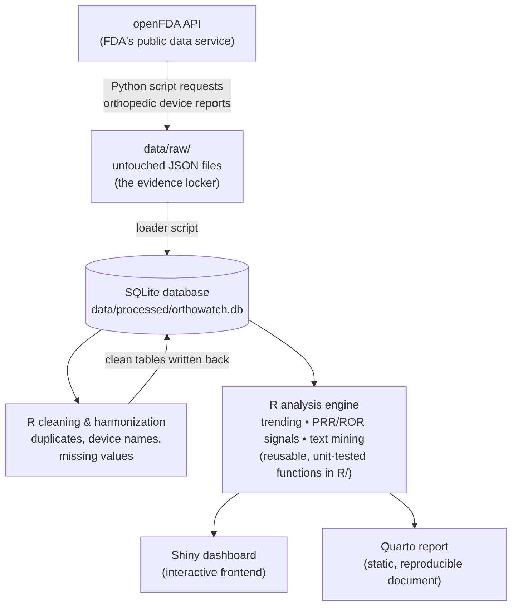

[← README](../README.md) · [All docs in order](../README.md#the-tutorial-in-order) · [Glossary](GLOSSARY.md)

# 00 — Architecture: how OrthoWatch fits together

**Prerequisites:** none. Read this before anything else.
**Learning goal:** after this page you can explain what every part of the
project does, why it exists, and how data flows through it — in plain words.

---

## Three words you need first

- **Database** — organized storage for data, arranged in tables (like
  spreadsheets that can be cross-referenced), which you question using a
  language called **SQL**. Ours is **SQLite**: the entire database is a
  single file on your laptop. No server, no account, no cost.
- **Backend** — code that works behind the scenes: fetching, cleaning,
  calculating. Users never see the backend, only its results.
- **Frontend** — the part a human looks at and clicks. Ours is a **Shiny
  dashboard** (Shiny turns R code into an interactive web page).

## The diagram

GitHub renders this automatically:

## What each box does, and why it exists

**openFDA API (the source).** An API is a website designed for programs
instead of people: your script sends a request ("give me adverse event
reports for hip prostheses"), the API sends back data. The FDA runs this
service for free; it serves publicly releasable Medical Device Reports from
the MAUDE database, from about 1992 to the present, updated weekly.

**data/raw/ (the evidence locker).** We save exactly what the API returned,
and we never edit those files. Why: in regulated analytics you must always
be able to prove what the source said. This is **traceability** — a habit
regulated industries treat as non-negotiable. If a number in the final report is
ever questioned, we can walk it back to a raw file.

**SQLite database (organized storage).** A hundred thousand reports in loose
files is chaos. Loaded into database tables, the same data can answer precise
questions in milliseconds via SQL ("count reports per device per month").
The whole database is one file, `orthowatch.db`, created by our own scripts.

**R cleaning & harmonization (backend, part 1).** Real FDA data is dirty:
duplicate reports, the same device spelled five ways, missing dates. Cleaning
is a separate, documented layer — not something done silently inside the
analysis — so every fix is visible and defensible. Clean tables are written
back into the same database alongside the raw ones.

**R analysis engine (backend, part 2).** Complaint trending, disproportionality
statistics (PRR/ROR — explained from zero in phase 4), and text mining live
here as plain R functions in the `R/` folder. They are *not* buried inside
the dashboard. Why: the same functions then power both serving outputs below,
and plain functions can be unit-tested (automated checks proving they compute
what we claim).

**Shiny dashboard (frontend).** For a quality engineer investigating: filter
by device family, watch trends move, drill into a signal.

**Quarto report (the record).** Quarto weaves text + R code + outputs into a
polished document that re-renders itself when the data updates. Real
surveillance runs on periodic reports that auditors can read; a dashboard
alone is not enough.

## The one design rule that makes it reproducible

Data flows **one way** (top to bottom in the diagram), and no step edits its
own input. Consequence: delete everything except `data/raw/` and the code,
rerun the pipeline, and you get byte-for-byte identical results. That
property — reproducibility — is a baseline expectation in regulated analytics
and a core habit of this project.

## Where each phase of the build lives

| Phase | Doc | Layer of the diagram |
|---|---|---|
| 1 | `02-phase-1-ingestion.md` | API → raw → database |
| 2 | `03-phase-2-cleaning.md` | Cleaning & harmonization |
| 3 | `04-phase-3-trending.md` | Analysis engine (trending) |
| 4 | `05-phase-4-signal-detection.md` | Analysis engine (PRR/ROR + tests) |
| 5 | `06-phase-5-text-mining.md` | Analysis engine (narratives) |
| 6 | `07-phase-6-shiny-dashboard.md` | Frontend |
| 7 | `08-phase-7-report-and-pipeline.md` | Quarto report + one-command glue |
| 8 | `09-phase-8-packaging.md` | README polish & release notes |

Next: [`01-setup.md`](01-setup.md) — building your workshop from a blank laptop.
