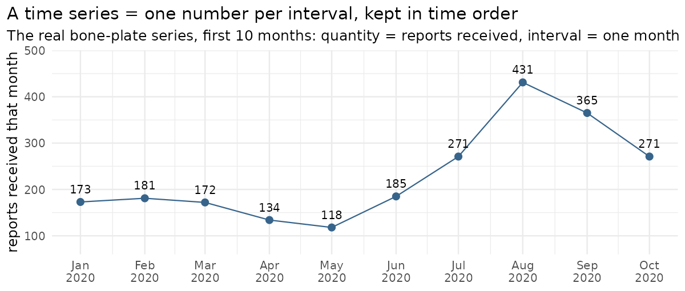
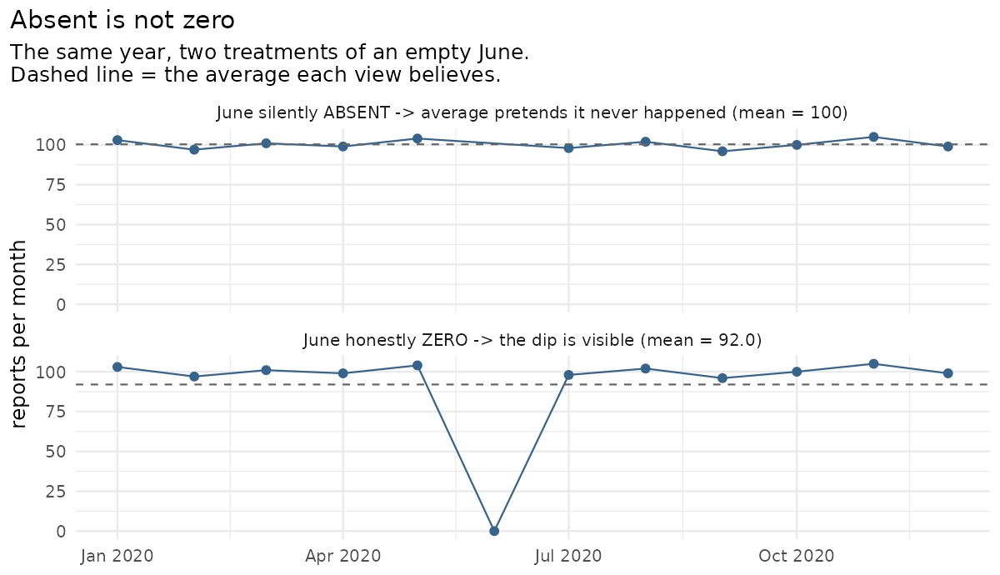
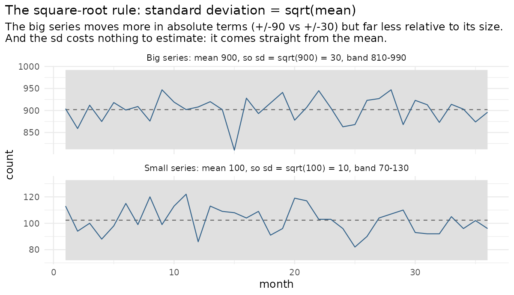
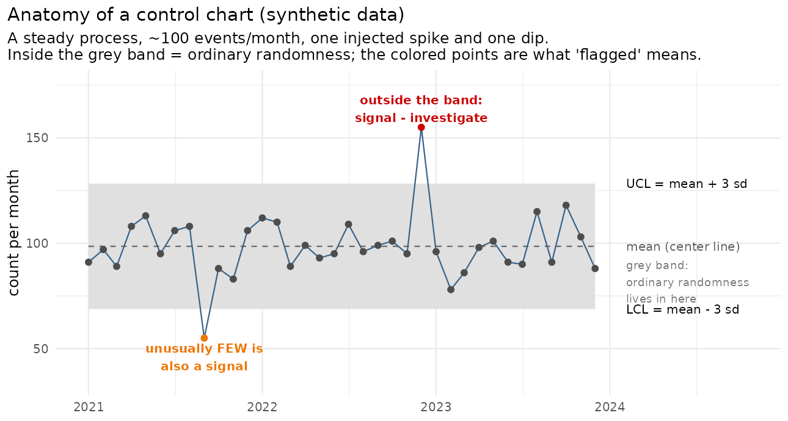

# 04 — Phase 3: Complaint trending — from counts to judgment

**Prerequisites:** Phase 2 complete — `clean_events` exists in the
database, checkpoint passed, committed.
**Learning goal:** after this phase you will understand what a time
series is, why a missing month is not the same as a zero, what averages
and standard deviation mean for counts, what a control chart
is and why factories invented it, how to draw charts in R with ggplot2,
and the discipline that separates "the data moved" from "something is
wrong".
**Why this phase exists in a real workflow:** picture the Monday-morning
question every surveillance team answers: *"anything unusual in last
month's reports?"* Eyeballing 60 months × 4 device families doesn't
scale, and eyes disagree — one reviewer's "spike" is another's "looks
fine". Trending replaces vibes with a rule: define, in advance and in
numbers, what "unusual" means; then let every month be judged by the
same bar. That rule is what this phase builds.

**How this guide works:** same as Phase 2 — section 4 walks the script
step by step; every step ends with **"You should see"** (sample output
from the reference run — your numbers will be identical this time,
because we're both computing from your own committed data) and **"What
it means"**.

**Session plan:**
- **Session A (~1.5 h):** concepts + steps 4.1–4.4 (counts two ways,
  zeros, first chart).
- **Session B (~1.5–2 h):** steps 4.5–4.9 (limits, flags, deep dive,
  figures, database) + commit.

---

## 1. Concepts, plainly

**Time series.** The same quantity, measured over and over at regular
intervals, kept in time order. Three ingredients: a quantity, an
interval, a span. Ours — quantity: how many reports arrived; interval:
per month; span: January 2020 to December 2024, i.e. 60 numbers in the
sequence. And because each device family is tracked separately, we
have four parallel time series, each 60 numbers long. The bone-plate
one literally begins 173, 181, 172, 134, 118, ... — one number per
month, marching through time.


*Your real bone-plate series, first ten months. Each dot is one month's
count; the sequence in time order IS the time series.*

**Absent is not zero.** When you count reports per month, a month with
*no* reports produces *no row* — it silently disappears. But "we
received zero reports in June" is real information (maybe surgeries
paused; maybe a reporting system was down). Before any statistics, we
rebuild the full calendar and write honest zeros into the silent
months. Skipping this step biases every average upward — a classic
silent bug.


*The same year twice. Top: June had zero reports but was skipped by the
count — the line glides over the gap and the average (dashed) is wrong.
Bottom: zero-filled, the dip is visible and the average is honest.*

**Average and standard deviation.** The **average** (mean) is the
series' typical level — bone plates run about 185 reports/month. No
month hits the average exactly; the **standard deviation** (σ,
"sigma") measures how far a typical month strays from it. The fact
this phase leans on: *when events arrive independently at a roughly
steady rate, monthly counts follow a Poisson distribution, whose
variance equals its mean — so σ = √mean.* Mean 185 → σ ≈ √185 ≈ 14.
Mean 900 → σ ≈ 30. Bigger series vary more in absolute terms but less
relative to their size — and, crucially, σ comes for free from the
mean, no separate estimation needed.


*Two simulated steady series with their 3-sd bands. The mean-900 series
swings more in absolute counts, yet its band is far narrower relative
to its size — both facts follow from sd = sqrt(mean).*

**The control chart.** Start from something you already do. Your
commute takes about 30 minutes — some days 27, some days 33, and you
think nothing of it: that's normal day-to-day variation. But if it
takes 55 minutes, you know *something happened* — an accident, a
closure. And if it takes 12, something happened too (holiday, empty
roads). Without any math, you already carry a mental line between
"ordinary variation" and "worth asking why". A control chart is
exactly that line, made explicit and automatic: compute the series'
average, compute its normal variation (the standard deviation), and
draw a band **three standard deviations** either side of the average.
Inside the band is the ordinary-variation zone — no action, however
jagged it looks. A point *outside* the band is a **signal**: too far
out to be ordinary variation, so investigate. Three standard
deviations is the convention because it is conservative: ordinary
variation essentially never crosses it, so a crossing deserves
attention. The band's edges are the **control limits** — upper (UCL)
and lower (LCL). Both directions matter: above the UCL = unusually
many reports; below the LCL = unusually few (reporting gaps and
real-world slowdowns live there — the 12-minute-commute case).


*Every part of the definition, on one picture: the dashed mean, the
grey band from LCL to UCL (mean ± 3 sd), thirty-four ordinary months
inside it, and the two flagged points — a spike above and a dip below.
The chart you build in step 4.5 is exactly this, once per device
family, on real data.*

**Signal ≠ verdict.** A flag means "this month is not ordinary
randomness" — full stop. WHY is a separate question: a real device
problem, one manufacturer submitting a year's backlog in one batch, a
pandemic pausing surgeries, a database migration. The flag opens an
investigation; it never closes one. (This mirrors the FDA's own caution
from the README: report counts are not failure rates.)

**ggplot2, in one breath.** R's standard charting package. You declare
what maps to what — x is the month, y is the count, color is the status
— and add layers: `geom_line()` draws lines, `geom_point()` dots,
`geom_ribbon()` shaded bands, `facet_wrap()` splits into one panel per
family. Declare and layer; that's the whole grammar.

## 2. Get the Phase 3 files into your repo

| File | Goes in | Job |
|---|---|---|
| `trending.R` | `R/` | The engine: monthly counting with zero-fill, control limits, flag table, the chart |
| `02_trending.R` | `analysis/` | The narrative: counts two ways → zeros → look → limits → flags → deep dive → save |

Also place the illustration folder `docs/img/` (four teaching PNGs
plus `make_illustrations.R`, the script that generates them — even the
diagrams in this tutorial are reproducible). These synthetic teaching
figures are deliberately separate from `figures/`, which will hold
outputs computed from the real data.

No new packages — `ggplot2` and `tidyr` arrived with tidyverse in setup.

**Files-landed check:**

```bash
ls R/trending.R analysis/02_trending.R docs/img/make_illustrations.R \
   docs/img/control_chart_anatomy.png docs/img/time_series_anatomy.png \
   docs/img/absent_vs_zero.png docs/img/sqrt_rule.png
```

**Read `R/trending.R` first**, top to bottom. The header explains the
statistics in one paragraph; each function explains its own reason for
existing, including the one honest limitation (a spike slightly raises
its own bar — see `add_control_limits()`'s comment).

## 3. What gets built

By the end of this phase three new things exist: a `figures/` folder
with the trend charts (these DO get committed — they're the README's
first screenshots), a `monthly_trends` table in the database (the
dashboard and report will read it instead of recomputing), and a
flagged-months table you'll have personally read and partly explained.

## 4. Run the script, step by step — with expected output every time

Open `analysis/02_trending.R`. Cursor on each chunk, `Cmd/Ctrl+Enter`,
compare with the samples.

### 4.1 Libraries, engine, connection

```r
library(DBI); library(RSQLite); library(dplyr); library(tibble)
library(tidyr); library(ggplot2)
source("R/trending.R")
con <- dbConnect(RSQLite::SQLite(), "data/processed/orthowatch.db")
```

**You should see:** silence (success). The Environment pane's Functions
section now lists `count_monthly`, `add_control_limits`,
`flagged_months`, `plot_trends`.

### 4.2 Monthly counts, in SQL

**You should see:**

```
# A tibble: 5 × 3
  device_family year_month     n
  <chr>         <chr>      <int>
1 Bone plate    2020-01      173
2 Bone plate    2020-02      181
3 Bone plate    2020-03      172
4 Bone plate    2020-04      134
5 Bone plate    2020-05      118
```

and `nrow(monthly_sql)` around `[1] 240` (4 families × 60 months —
fewer only if some month had zero reports and is therefore absent).

**What it means:** the database itself did the counting (`GROUP BY` =
"make one row per family-month"). These are the very numbers you saw at
the end of Phase 2.

### 4.3 The same counts in dplyr, and the agreement check

**You should see** the `all.equal(...)` line print:

```
[1] TRUE
```

**What it means:** SQL and dplyr are two languages for the same
question — *where the data lives* (database vs. desk) differs, the
answer must not. `TRUE` is your cross-check. Anything else (a list of
differences) means the two paths diverged — stop and investigate, don't
proceed on disagreeing numbers. This "compute it twice, independently"
habit is cheap insurance you'll reuse forever.

### 4.4 Fill the silent months, then LOOK

**You should see:**

```
[1] 240
[1] 0
```

(240 rows = full grid; 0 silent months — with tens of thousands of
reports per family, every month had at least one. The zero-fill matters
the day it doesn't.) Then the first chart appears in RStudio's Plots
pane (bottom-right): **four stacked panels**, one per family, blue
lines. Before scrolling on, actually look — you should be able to see
with bare eyes: a sharp **hump in Bone plate around mid-2020**; **Knee
prosthesis climbing** through 2024 to the highest levels in the whole
window; Hip comparatively steady; Spinal drifting gently downward. Note
what YOUR eyes flag — the statistics get their turn next, and comparing
your intuition against the formal flags is half the lesson.

### 4.5 Control limits — the bar, per family

**You should see** (rounded; your values exactly, since same data):

```
# A tibble: 4 × 5
  device_family   center sigma   ucl   lcl
  <chr>            <dbl> <dbl> <dbl> <dbl>
1 Bone plate        185.  13.6  226.  144.
2 Hip prosthesis    513.  22.6  581.  445.
3 Knee prosthesis   564.  23.7  635.  493.
4 Spinal fixation   148.  12.1  184.  111.
```

**What it means:** read one row aloud to make it concrete: *bone plates
average ~185 reports/month with σ ≈ 14, so anything above ~226 or
below ~144 is beyond ordinary randomness.* Notice the square-root rule
live in the table: hips average ~2.8× bone plates, but their σ is only
~1.7× bigger (√2.8 ≈ 1.7).

Then `p_trends` draws the full control chart: same four panels, now
with a **grey band** (the ordinary-randomness zone), a **dashed
average line**, and dots colored grey (within), **red (above limit)**,
or **orange (below limit)**.

### 4.6 The flagged-months table

**You should see** a table of the months outside the band, most extreme
first — the top of it looking like:

```
# A tibble: ~xx × 8
  device_family month_date     n center   ucl   lcl status      distance
  <chr>         <date>     <int>  <dbl> <dbl> <dbl> <chr>          <dbl>
1 Bone plate    2020-08      431   185.  226.  144. above limit    18.1
2 Bone plate    2020-09      365   185.  226.  144. above limit    13.2
3 Bone plate    2020-07      271   185.  226.  144. above limit     6.3
4 Bone plate    2020-10      271   185.  226.  144. above limit     6.3
...
```

plus further rows for other families — expect knee months from late
2024 flagged above (that visible ramp), and scattered below-limit
months (look especially at spring 2020, when elective surgeries paused
worldwide and reports of all kinds dipped).

**What it means:** `distance` is "how many standard deviations from
the average" — the severity ranking. The bar for flagging is 3; August
2020's bone plates sit **18 standard deviations out**, which is not a
borderline judgment call but a klaxon. Your eyes (4.4) and the statistics now agree, and the
statistics added a ranking your eyes couldn't.

**Expect MANY flags — and understand why.** The reference run flags
152 of 240 months. That is not the chart misbehaving; it's the chart's
core assumption being violated, visibly: control limits assume a
*stable* process around one average, and these series trend hard (hips
fell from ~800/month in 2020 to ~300 by 2023–24; knees ramped the
opposite way). Against a single five-year mean, trending series flag
early months high and late months low almost by definition. Every flag
is still a true statement — but 150 alarms is alarm fatigue, and the
professional refinement is a *rolling* baseline (e.g., limits from the
trailing 12 months), which is exactly the extension the engine's
comments promised. It stays on the roadmap; meanwhile the giant,
isolated flags are the ones that matter — none more than **Spinal
fixation, July 2021: 776 reports vs a typical ~148 (+51.7 sd), for one
month only** — the classic silhouette of a batch submission.

Also notice what the table does NOT say: nothing about why. That's 4.7.

### 4.7 Deep dive — what drove the bone plate spike?

The script splits bone plate 2020 into the spike window (Jul–Oct) vs.
the rest of the year, then compares (a) reported problem types and
(b) manufacturers across the two windows.

**You should see:** two small tables, top-5 rows per window each. The
exact contents are yours to read — this step is deliberately not
pre-chewed, because reading it IS the skill. What to look for:

**First, normalize:** the two windows are unequal (8 baseline months
vs 4 spike months), so raw totals mislead — divide each count by its
window's months and compare *rates*. Then:

- If one problem type or one manufacturer dominates the spike window
  but not the baseline → the spike is **concentrated**: the classic
  fingerprint of a specific device issue *or* of one company submitting
  a large batch of reports at once (both look identical in counts —
  only reading narratives, Phase 5, can tell them apart).
- If the spike spreads evenly across problems and manufacturers →
  think **process causes**: reporting-system changes, regulatory
  deadlines, data migrations.

**What it means:** you've just done the first move of a real
investigation: *when* (the flag) → *what/who* (the drill-down). A real
team would now pull the individual reports; a public analysis stops at
"concentrated in X, warrants investigation" — which is exactly how the
README promises we treat this data. Write two or three sentences of
your own verdict in a comment at the bottom of the script — dated,
initialed. That habit (recording judgments next to the code that
prompted them) is regulated-industry gold.

### 4.8 Save the figures

**You should see:**

```
[1] "trend_bone_plate.png" "trend_by_family.png"
```

**What it means:** a new `figures/` folder holds the charts as PNG
images. Unlike `data/`, figures ARE committed — they're small, they're
the README's screenshots, and they let a repo visitor see results
without running anything. Open both files (click them in the Files
pane) — this is what the project shows the world.

### 4.8b Optional but worthwhile: the interactive twin

Static PNGs are the official record (they render in the README; an
interactive file cannot — GitHub displays HTML as code, not as a page).
But for actually *exploring* 240 data points, a browser adds real
value: hover any dot to read its exact month, count, status, and
distance in standard deviations; drag a box over the 2020 spike to
zoom (double-click resets); click a legend entry to hide or show a
whole status group. That's genuine reviewer utility, so the engine
gains one function — `plot_trends_interactive()` — which converts the
*same* chart with plotly, a widely used interactive charting library.
No new chart types are invented here on purpose: the control chart IS
the standard surveillance artifact; interactivity is worth adding,
novelty is not.

One-time setup, in the Console:

```r
install.packages("plotly")   # a few minutes of compiling; one time only
renv::snapshot()             # record it, so the project stays reproducible
```

Then run the 8b chunk of the script.

**You should see:** first, the chart appears in RStudio's **Viewer**
pane (not Plots — interactive widgets live in Viewer) and reacts to
your mouse. Then `saveWidget()` writes
`figures/trend_by_family.html` (~4 MB — it embeds the whole plotly
library so the file works anywhere with no internet). Open it in your
real browser and hover the August 2020 bone-plate dot: the tooltip
reads its family, month, count, and roughly `+18.1 sd from average`.

**What it means:** the file in `figures/` is a throwaway preview —
regenerated on every run and ignored by Git on purpose (Git keeps
every version of every file forever; re-committing 4 MB per run would
bloat the repository's permanent history). Sharing it with the world
is a separate, deliberate act — that's 4.8c. And notice what you did
NOT have to do: redesign anything. One function converts the existing
ggplot — the one-engine design paying off.

### 4.8c Publish the interactive chart as a real web page

Clicking an HTML file on github.com shows its *source code* — GitHub's
file viewer never renders pages (a security choice). But GitHub offers
a second, free mechanism built for exactly this: **GitHub Pages**,
which serves files from your repo as an actual website at
`https://YOURNAME.github.io/REPO/...`.

Why this works for our widget — a distinction worth owning permanently:

| | This plotly widget | The Phase 6 Shiny app |
|---|---|---|
| Interactivity runs | in the **visitor's browser** (JavaScript inside the file) | on a **live R server** |
| Hover, zoom, toggle | ✅ | ✅ |
| Re-query the database, recompute, drill into reports | ❌ | ✅ |
| Hosting needed | any static file host — Pages suffices | an R server (different hosting, Phase 6) |

Hover-and-zoom is *client-side* — the file carries everything it
needs, so a plain file server is enough. Anything that must *compute*
stays server-side; that's the line between this page and Phase 6.

**The publish step** (script block 8c) copies the widget into
`docs/interactive/` — committed, unlike the `figures/` preview — and
drops a marker file `docs/.nojekyll` (which tells Pages "serve these
files as they are" instead of trying to build a website from the
folder). Publishing is deliberate: re-run 8c when results change, not
on every experiment, so the ~4 MB file enters Git history rarely.

**One-time Pages setup** (after this phase's commit+push):

1. On github.com, open your repo → **Settings** → **Pages** (left
   sidebar).
2. Under *Build and deployment*: Source = **Deploy from a branch**;
   Branch = **master**, folder = **/docs**. Click **Save**.
3. Wait a minute or two (GitHub builds quietly), then open:
   `https://akannan2987.github.io/orthowatch/interactive/trend_by_family.html`

**You should see:** the control chart in your browser — from a public
URL anyone can open, no R, no downloads — hover, zoom, and legend
toggles all working. This link can go in the README, the docs, or a
message to anyone.

*(Optional size trim: `plotly::partial_bundle(ip)` before saving cuts
the embedded library to just the pieces this chart uses — often ~1 MB
instead of ~4. It downloads the trimmed bundle from plotly's servers
at save time; if that errors on your network, skip it — the full size
is fine.)*

### 4.9 Write monthly_trends into the cabinet

**You should see:**

```
[1] "clean_events"   "monthly_trends" "raw_events"
```

**What it means:** the cabinet now holds three tables — evidence,
analysis-ready events, and computed trends. The dashboard (Phase 6) and
report (Phase 7) will *read* `monthly_trends` rather than recompute it:
one engine, one result, many consumers. (Desk reminder: nothing new
appears in the Environment pane's data section beyond the objects you
made — the table lives in the cabinet.)

## 5. Checkpoint

1. The SQL-vs-dplyr agreement check printed `TRUE` (4.3).
2. The four-panel control chart exists and matches your bare-eyes
   reading: bone plate mid-2020 hump flagged red; knee late-2024 ramp
   flagged; some orange below-limit dots around spring 2020 (4.4–4.6).
3. You read the deep-dive tables and wrote your two-sentence verdict
   in the script (4.7).
4. `figures/` contains both PNGs (4.8); `dbListTables()` shows three
   tables (4.9). If you did 4.8b: the HTML opens in your browser and
   hovering works — and `git status` does NOT list it (the ignore rule
   at work).
5. **Re-run test:** Session → Restart R, Source the script top to
   bottom — same limits, same flags, same figures.

## 6. Commit checkpoint — and the README gets its first pictures

Two README edits before committing:

1. Build log: set the Phase 3 row to
   `| 3 | [Complaint trending](docs/04-phase-3-trending.md) | ✅ |`
2. Screenshots: replace the "coming with the dashboard phase" line
   under **The data at a glance** with:

```markdown
**First results** — monthly reports per device family with 3-sigma
control limits (grey band = expected range if reporting were steady;
red dots = months flagged for investigation):


▶ [Explore the interactive version](https://akannan2987.github.io/orthowatch/interactive/trend_by_family.html)
— hover any point for its exact numbers; drag to zoom. *(Live after
the one-time GitHub Pages setup in the Phase 3 guide, §4.8c.)*
```

Then:

```bash
git add .
git status    # expect: R/trending.R, analysis/02_trending.R, docs/04-...,
              # README.md, figures/*.png — and still NO data/ files
git commit -m "Phase 3: complaint trending with 3-sigma control limits; flag bone plate 2020 spike (18 sigma); publish first figures"
git push origin develop develop:beta develop:master
```

Refresh the repo on github.com: your README now shows an actual chart
of actual FDA data with actual flags. That picture is the project's
first real result in public.

## 7. What could go wrong (mini-FAQ)

**The agreement check (4.3) isn't TRUE** — the two counting paths
disagree. Usual cause: the events pull filtered differently than the
SQL (check the WHERE clause vs. the filter()). Don't proceed until
they agree.

**Plots pane shows nothing / "figure margins too large"** — the pane
is too small to draw in. Drag it bigger, or click Zoom to open the
chart in its own window.

**`could not find function "count_monthly"`** — `source("R/trending.R")`
skipped, or wrong working directory (`getwd()`; open the `.Rproj`).

**My flag list has a few more/fewer rows than the sample** — the
borderline months (distance just above/below 3) are sensitive to tiny
count differences, and the sample shows only the table's top. The big
flags (bone plate Jul–Oct 2020, the knee ramp) must be present; the
borderline tail may differ. If a BIG flag is missing, re-check 4.3.

**`ggsave` errors with "no such directory"** — the `dir.create`
line didn't run; run it, then re-save.

**Below-limit flags feel like errors** — they're not; they're the
lower half of the same logic. Unusually few reports is also a process
change (reporting gap, surgery slowdown). The chart colors them orange
precisely so you notice them separately.

**`saveWidget` errors mentioning pandoc** — saving a self-contained
widget needs a helper tool called pandoc. Inside RStudio this "just
works" (RStudio bundles pandoc); the error appears when running from a
bare terminal instead. Run the 8b chunk inside RStudio.

**The interactive chart shows in Viewer but the HTML file won't open
nicely from GitHub** — expected: GitHub shows HTML files as source
code, not as rendered pages, which is exactly why the file is
gitignored and the PNGs remain the official screenshots.

**The Pages URL gives a 404** — work through these in order: (1) Is
the file really on master? Check the raw copy:
`https://raw.githubusercontent.com/USER/REPO/master/docs/interactive/FILE.html`
— 404 there means it wasn't committed/pushed; a page of HTML means it
was. (2) Has Pages *deployed* it yet? Don't guess — watch: the repo's
**Actions** tab lists every "pages build and deployment" run; a
spinner means still building (queues of several minutes happen), a
green check means live. (3) Browser cache: browsers briefly remember
404s, so after the green check, hard-refresh (Cmd+Shift+R) or use a
private window. Also: Settings → Pages must say branch master +
folder /docs, and URLs are case-sensitive.

**The figures in this document don't display** — you're reading the
raw markdown locally (RStudio shows text, not rendered pages). View the
doc on github.com after pushing, where images and formatting render —
same lesson as the README's diagram: markdown is sheet music; the
viewer is the orchestra.

**`database is locked`** — a stale connection; `dbDisconnect(con)`
everywhere or restart R.

## 8. Two ways to run everything (running tally)

| Capability | Manual path (now) | Automatic path (later) |
|---|---|---|
| Fetch / load | `python ingest/...` scripts | Phase 7 one-command pipeline |
| Clean | `analysis/01_clean_events.R` | same pipeline, same engine |
| Trend + flag | `analysis/02_trending.R` step by step | pipeline recomputes `monthly_trends`; dashboard reads it live |
| Inspect | Plots pane + flag table | Shiny dashboard (Phase 6) |

---

**Next:** `05-phase-4-signal-detection.md` — trending asks "is this
month unusual for this family?"; signal detection asks the sharper
question "is this *problem* unusually associated with this *device*?"
(the PRR/ROR statistics used in real vigilance) — plus the project's
first automated tests, so the math can never silently break.
