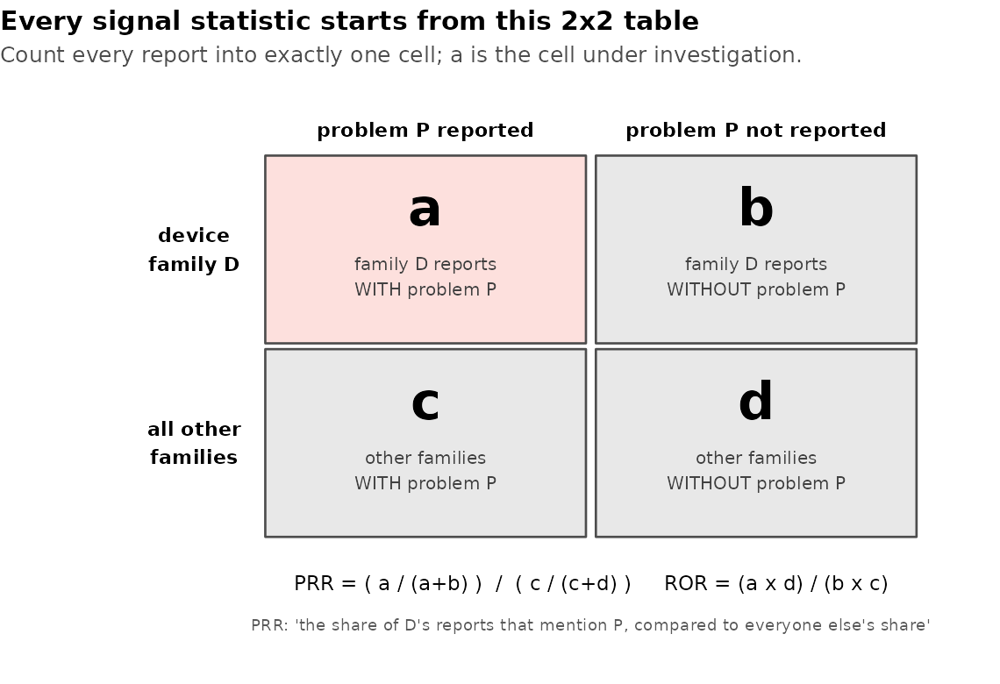

# 05 — Phase 4: Signal detection — which problems belong to which devices?

**Prerequisites:** Phases 1–3 complete; `clean_events` and
`monthly_trends` in the database; Phase 3 committed.
**Learning goal:** after this phase you will understand contingency
tables, proportions vs. odds, the two workhorse statistics of device
vigilance (PRR and ROR), confidence intervals in plain terms, the
published rule for calling something a signal — and, on the software
side, what unit tests are, how to read testthat output, and why the
test suite for this very engine caught a real bug before you ever ran
it.
**Why this phase exists in a real workflow:** Phase 3 told us *when*
counts moved, but its flags drowned in the families' volume trends
(152 of 240 months!). The question a safety reviewer actually needs
answered is sharper and volume-proof: *is problem P over-represented
among family D's reports, compared to everyone else's?* Because each
family is measured against **its own** report total, a family
reporting more overall gains nothing — the weakness that flooded
Phase 3 simply cancels out.

**How this guide works:** as always — every step ends with **"You
should see"** and **"What it means"**. Family totals are your exact
committed numbers; problem-level results are shown as shapes for you
to fill in.

**Session plan:**
- **Session A (~1.5–2 h):** concepts + steps 4.1–4.5 (the statistics,
  computed and read).
- **Session B (~1.5 h):** steps 4.6–4.9 (plot, tests, database) +
  verdict + commit.

---

## 1. Concepts, plainly

One everyday example carries this whole section: **you moderate
reviews for an online marketplace** that sells phones, laptops,
headphones, and much else. The question on your desk: *is "battery
drains fast" unusually common in PHONE reviews — or is it just a
common complaint about everything?* Swap "phone" for "hip prosthesis"
and "battery" for "corrosion" and you have this phase.

**The contingency table.** Sort *every review in the store* by two
yes/no questions at once — is it about a phone? does it mention the
battery? Four piles result:



`a` = phone reviews mentioning battery, `b` = phone reviews that
don't, `c` = other products' reviews mentioning battery, `d` = the
rest. Every review lands in exactly one pile; `a` is the pile under
investigation and the other three are its context. In our project:
reports instead of reviews, device families instead of product types,
problems instead of complaints.

**Proportion vs. odds — two ways to say "how common".** If 8 of 100
phone reviews mention the battery: the *proportion* is 8 in 100; the
*odds* are 8-with per 92-without. Same fact, two packagings — and
each gets its own classic ratio below.

**PRR — Proportional Reporting Ratio.** Compare shares: the battery's
share of phone reviews, divided by its share of everyone else's
reviews. PRR = (a/(a+b)) / (c/(c+d)). If 8% of phone reviews mention
battery but only 2% of other reviews do, PRR = 4: *"battery
complaints take up four times as large a share of phone reviews as of
everyone else's."* PRR = 1 means nothing special. Crucially, each
product is measured against **its own** review total — a product with
many reviews gains nothing — which is exactly why this statistic is
immune to the volume trends that flooded Phase 3.

**ROR — Reporting Odds Ratio.** The same comparison using odds:
ROR = (a×d)/(b×c). Vigilance teams compute both; ROR earns its seat
because it comes with a textbook formula for a confidence interval —
next concept. (When a cell is zero the raw ratio explodes to 0 or
infinity; the standard Haldane fix adds 0.5 to every cell, and the
engine applies it automatically.)

**Confidence interval (95% CI) — the polling margin, for ratios.**
Election polls never say "52%"; they say "52%, margin ±3" — an honest
admission that they asked a sample, not everyone, so luck-of-the-draw
could move the number a little. Our CI is the same admission for a
ratio: the range of true values plausibly compatible with the data,
luck included. Small `a` → wide interval (a ratio built on 5 reports
could easily be luck); large `a` → narrow. The reading rule: **if
even the interval's LOWER end sits above 1, "just luck" stops being a
comfortable explanation.**

**Chi-square (χ²) — surprise, with the amount of data priced in.**
Flip a coin 10 times and get 6 heads: unremarkable. Flip it 1,000
times and get 600 heads: something is wrong with that coin — *same
60%, completely different surprise*, because more data leaves less
room for luck. χ² is one number that prices in both how far a table
tilts AND how much data tilts it. Convention: χ² ≥ 4 ≈ the familiar
p < 0.05 bar.

**The Evans rule — three hurdles, like a loan approval.** A bank
doesn't lend on income alone: it wants sufficient income AND a clean
credit history AND proper documentation, because each guards against
a different way of being wrong. The published signal rule (Evans and
colleagues, 2001 — the standard first-pass in vigilance) works the
same way, and each hurdle blocks a different false alarm:

| Hurdle | Blocks |
|---|---|
| PRR ≥ 2 (share at least doubled) | effects too small to matter |
| χ² ≥ 4 (statistically surprising) | tables explainable by luck |
| a ≥ 3 (at least three reports) | conclusions built on one anecdote |

All three at once = **signal**.

**What a signal is NOT.** In the marketplace: lots of battery
complaints in phone reviews doesn't prove phones are broken — maybe
battery-annoyed people review more, or one loud reviewer posts
constantly. Same here, precisely: the denominator is *reports*, not
surgeries (we don't know how many implants are in use); reporters'
vocabulary differs; one company's batch submissions (Phase 3!) can
tilt a table. **Over-reported ≠ over-occurring.** A signal opens an
investigation; it never closes one.

**Unit tests — a permanent answer key.** Before trusting a new
calculator you'd punch in 12 × 12 and check for 144 — a problem you
can verify by hand. A unit test is exactly that, written down: a tiny
input worked out on paper, plus the demand that the code return that
answer, re-checkable forever with one command (`Rscript
tests/run_tests.R`). Silent when everything holds; loud the moment an
edit breaks the math. And this project's suite has already earned its
keep: **it caught a real bug in this very engine before the code met
real data** — R stores counts as 32-bit integers (max ≈ 2.1 billion),
and the χ² denominator multiplies four of them straight past that
ceiling into NA. The hand-worked test refused to pass; the one-line
fix sits in the engine with a comment telling the story. That is what
tests are for.

## 2. Get the Phase 4 files into your repo

| File | Goes in | Job |
|---|---|---|
| `signal_detection.R` | `R/` | The engine: 2x2 cells, PRR/χ²/ROR + CI, Evans rule, forest plot |
| `03_signal_detection.R` | `analysis/` | The narrative walkthrough |
| `run_tests.R` | `tests/` | One-command test runner |
| `test-signal_detection.R` | `tests/testthat/` | Hand-worked math tests (+ the overflow guard) |
| `test-trending.R` | `tests/testthat/` | Phase 3's smoke checks, made permanent |
| `contingency_2x2.png` | `docs/img/` | The diagram above |
| `make_illustrations.R` | `docs/img/` (replaces) | Now also generates the 2x2 diagram |

One-time install, in the Console:

```r
install.packages("testthat")
renv::snapshot()
```

(You can delete `tests/.gitkeep` — the folder has real contents now.)

**Files-landed check:**

```bash
ls R/signal_detection.R analysis/03_signal_detection.R tests/run_tests.R \
   tests/testthat/test-signal_detection.R tests/testthat/test-trending.R \
   docs/img/contingency_2x2.png
```

## 3. Run the script, step by step

Open `analysis/03_signal_detection.R`; chunk by chunk as always.

### 4.1 Libraries, engine, connection

**You should see:** silence; Functions pane lists
`build_problem_table`, `signal_stats`, `plot_top_signals`.

### 4.2 Events and the denominators

**You should see** your exact family totals:

```
# A tibble: 5 × 2
  device_family       n
1 Knee prosthesis 33834
2 Hip prosthesis  30754
3 Bone plate      11097
4 Spinal fixation  8852
5 Other              10
```

**What it means:** these totals are the a+b denominator of every hip
2x2, knee 2x2, and so on ("Other" is excluded by the engine — ten
reports can't support ratios).

### 4.3 The problem table

**You should see:** `nrow(problems)` somewhere near or above the
report count (reports can mention several problems, and some mention
none), a distinct-problem count in the low-to-mid hundreds, and a
top-10 led by names you met in Phase 3's deep dive — the vague
"Adverse Event Without Identified Device or Use Problem", "Break",
"Fracture", and kin.

**What it means:** this long table is the raw material; each of its
rows will land in an `a` or `c` cell somewhere.

### 4.4 All the statistics at once

**You should see:** `nrow(stats)` of a few hundred (pairs surviving
the ≥30-mentions floor), and `glimpse()` showing the columns:
`a b c d prr chi2 ror ror_lo ror_hi evans_signal`.

**What it means:** several hundred 2x2 tables were built, tested, and
scored in one call — the payoff of writing engines, not scripts.

### 4.5 The signal table

**You should see** a table shaped like this (your values differ):

```
   device_family   product_problem            a   prr  chi2   ror ror_lo ror_hi
 1 <family>        <problem>               xxxx  xx.x  xxxx  xx.x   xx.x   xx.x
 2 ...
```

sorted strongest-first, with `nrow(signals)` telling you how many
pairs pass Evans. **What it means:** read a row aloud using the
template in the script's comments, then work through the three sanity
questions there — clinical plausibility, reporter effects, and where
the vague catch-all category lands. This is the judgment step; write
your dated verdict comment at the file's bottom, Phase 3 style.

### 4.6 The forest plot

**You should see** four panels of dots-with-whiskers on a log axis,
every whisker clear of the dashed line at 1; saved to
`figures/signals_top.png`.

**What it means:** each family's strongest signals with their
uncertainty made visible — small `a` means long whiskers. This is the
figure a review meeting would open with.

### 4.6b–4.6c Optional: the interactive twin, previewed then published

Same two-step pattern as Phase 3 (§4.8b–4.8c there, where the
concepts — client-side widgets, why previews are gitignored, GitHub
Pages — are explained in full; they all carry over unchanged). What's
*better* justified this time: the static forest plot truncates
problem names to fit the axis and hides the counts behind each dot,
while the hover tooltip carries the **full problem name plus the
entire 2x2 (a, b, c, d), PRR, χ², and the ROR with its interval** —
everything a reviewer would otherwise look up by hand.

**You should see (6b):** the chart in RStudio's Viewer; hovering the
top hip signal shows its full name and a tooltip ending in something
like `ROR 33.2 (95% CI 25.3-43.6)`. `figures/signals_top.html`
appears — and `git status` does NOT list it (the Phase 3 ignore rule
at work, no new rule needed).

**You should see (6c):** `docs/interactive/signals_top.html` staged
for commit. Pages needs no new setup — after this phase's push the
chart is live at
`https://akannan2987.github.io/orthowatch/interactive/signals_top.html`.

*(These two functions — trends and signals — are literally the chart
layer of Phase 6's dashboard, being built ahead of time.)*

### 4.7 *(numbering note: script sections 7–8 = doc 4.8–4.9)*

### 4.8 Run the tests — then break one on purpose

In the **Terminal**, project root:

```bash
Rscript tests/run_tests.R
```

**You should see** (details may vary slightly):

```
✔ | F W  S  OK | Context
✔ |        13 | signal_detection
✔ |         9 | trending

== Results =====================================================================
[ FAIL 0 | WARN 0 | SKIP 0 | PASS 22 ]
```

**Now the exercise:** open `tests/testthat/test-signal_detection.R`,
change the expected PRR from `2.0` to `2.1`, rerun. **You should
see** a failure block naming the test, the expected value, and the
actual — read its anatomy, because someday a *real* red run will be
telling you an edit broke the math. Revert to `2.0`, rerun, green.
Failure you caused and understood is the cheapest kind.

### 4.9 Write signal_stats into the cabinet

**You should see:**

```
[1] "clean_events"   "monthly_trends" "raw_events"     "signal_stats"
```

Four tables: evidence, analysis-ready events, trends, signals. The
Phase 6 dashboard now has a signals view waiting for it.

## 5. Checkpoint

1. Family totals matched your committed numbers exactly (4.2).
2. You read the signal table and answered the three sanity questions;
   a dated verdict comment sits at the script's bottom (4.5).
3. `figures/signals_top.png` exists and matches the on-screen plot.
4. `Rscript tests/run_tests.R` is green — and you've seen it red once,
   on purpose, and understood the message (4.8).
5. `dbListTables()` shows four tables (4.9).
6. Re-run test: restart R, Source the script — identical stats table.

## 6. Commit checkpoint

README build log, row 4 →
`| 4 | [Signal detection + automated tests](docs/05-phase-4-signal-detection.md) | ✅ |`

And if you built the interactive twin, add its link to the README
right after the existing trends link:

```markdown
▶ [Signals, interactive](https://akannan2987.github.io/orthowatch/interactive/signals_top.html)
— each family's strongest signals; hover for the full problem name,
the 2x2 counts, and the confidence interval.
```

```bash
git add .
git status   # expect: engine, script, tests/, doc, figure, README —
             # no data/, no figures/*.html
git commit -m "Phase 4: PRR/ROR disproportionality signals with Evans criteria; first testthat suite (22 tests, caught an integer overflow)"
git push origin develop develop:beta develop:master
```

## 7. What could go wrong (mini-FAQ)

**`NaN` or `Inf` in prr/ror** — a zero cell slipped past the Haldane
correction path for PRR (which we leave uncorrected by design; PRR of
Inf just means "family-only problem" — it will fail the χ²/a floors
or deserve a very close look). If chi2 is NA instead: you're running
the pre-fix engine; make sure the `across(... as.numeric)` line is
present.

**Everything signals / nothing signals** — check `min_problem_total`:
too low floods the table with noisy rare problems; too high starves
it. 30 is a stated judgment, not a law — tune it and say so in a
comment.

**Tests fail after you edited the engine** — that's the suite doing
its job, not an obstacle. Read which expectation broke: either your
edit changed the math (revert or re-derive the hand-worked answer) or
the test's claim is genuinely outdated (update the test, with a
comment saying why).

**`could not find function` when running tests** — run from the
project root (`Rscript tests/run_tests.R`), not from inside tests/;
the runner sources the engines by relative path.

**The vague catch-all category tops a family's signals** — pause
before believing it: a category that exists everywhere should
struggle to be over-represented anywhere. If it still signals,
suspect reporter behavior (Phase 3's batch-submission fingerprint)
and say so in your verdict.

**`database is locked`** — the usual: stale connection; disconnect or
restart R.

## 8. Two ways to run everything (running tally)

| Capability | Manual path (now) | Automatic path (later) |
|---|---|---|
| Fetch / load / clean / trend | as before | Phase 7 pipeline |
| Signal detection | `analysis/03_signal_detection.R` | pipeline recomputes `signal_stats`; dashboard reads it |
| Verify the math | `Rscript tests/run_tests.R` | same command inside the pipeline (and, later, CI) |

---

**Next:** `06-phase-5-text-mining.md` — the numbers have had their
say; now the *narratives* get theirs: mining the free-text stories on
the reports to find what the categorical fields can't express — and to
settle questions like whether that 2020 spike's "unspecified problem"
reports actually describe anything specific at all.
