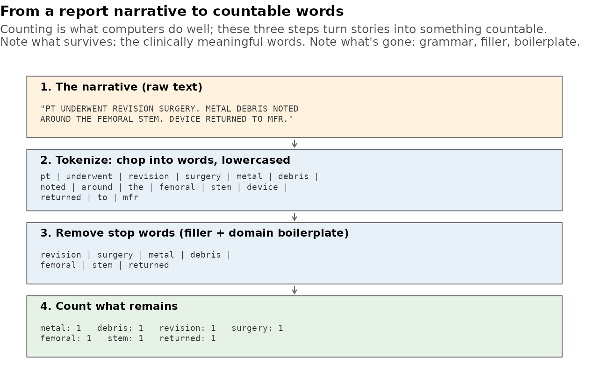

[← README](../README.md) · [All docs in order](../README.md#the-tutorial-in-order) · [Glossary](GLOSSARY.md)

# 06 — Phase 5: Text mining — the narratives get their say

**Prerequisites:** Phases 1–4 complete; four tables in the
database (`raw_events`, `clean_events`, `monthly_trends`,
`signal_stats`); Phase 4 committed.
**Learning goal:** after this phase you will understand tokenization,
stop words, why word *rates* (not counts) are compared, how Phase 4's
2×2 rate-ratio idea applies unchanged to words, and the discipline of
letting counting *guide* and reading *decide*. You will also close the
two open questions your own earlier findings raised.
**Why this phase exists in a real workflow:** the categorical fields
are the tip of every report; the substance is the free-text narrative.
Surveillance teams mine narratives because codes are coarse, optional,
and reporter-dependent — your own data proves it: the vague
"unidentified problem" code is mentioned on 26,093 reports — though,
as Mission A discovers, only 227 carry it *alone*; for the rest it
rides alongside specific codes. Whatever the truly-vague reports
know, only their text can say.

**How this guide works:** the usual — every step ends with **"You
should see"** and **"What it means"**. Family-level word results are
shown as shapes (they're yours to discover); structural numbers use
your committed figures.

**Session plan:**
- **Session A (~1.5–2 h):** concepts + steps 4.1–4.4 (measure, tokenize,
  distinctive vocabularies, figures).
- **Session B (~1.5 h):** steps 4.5–4.7 (the two missions, database,
  tests) + verdicts + commit.

---

## 1. Concepts, plainly

The running example this time is one you already live inside:
**search engines and word clouds don't read — they count.** Everything
below is the machinery that makes counting text honest.

**Tokenization — chopping text into countable pieces.** A computer
can't "read" a narrative, but it can split one into lowercase words —
like splitting a long receipt into individual items before totaling
them. Each surviving word is a **token**:



**Stop words — the filler that counts for nothing.** "The", "and",
"was" dominate any English text while distinguishing nothing —
indexing a phone book, you'd skip "Mr" and "Ms". We remove the
standard filler list (1,149 words) *plus* a short domain list:
words like "patient" and "device" appear in virtually every MDR
narrative, so they're this dataset's own filler. The domain list is
kept short on purpose — the statistic below already downweights
words that appear everywhere; the list only declutters. (It's a
stated judgment, in the engine, editable.)

**Rates, not counts — the Phase 4 lesson again.** Knee narratives
contain far more total words than spinal ones, so raw counts would
crown knees at everything. As always, each family is its own
denominator: words per 10,000 words of that family's text.

**Distinctive terms — Phase 4's 2×2, with words in the cells.** For
word *w* and family *D*: how many of D's words are *w*, versus how
many of everyone else's are? Divide the two rates and you have a rate
ratio — PRR arithmetic applied to vocabulary, smoothing against
zeros included (the Haldane idea again). We report it as
**log2_ratio** for readability: +1 = twice the rate, +3 = eight
times, −1 = half. One statistical idea now carries two phases — worth
noticing, because collecting *ideas* beats collecting formulas.

**Counting guides, reading decides.** Word statistics point at where
to look; they can't tell you *why* a word is frequent (clinical
reality? one reporter's template pasted 500 times?). That's why both
missions below end with you reading actual sampled narratives. The
statistics are the map; the reading is the territory.

**What narrative mining is NOT.** These are unverified reporter
stories, full of copied boilerplate and legal hedging. Distinctive
wording is a *lead* — never a finding about any device.

## 2. Get the Phase 5 files into your repo

| File | Goes in | Job |
|---|---|---|
| `text_mining.R` | `R/` | The engine: tokenizer, term stats, both plots |
| `04_text_mining.R` | `analysis/` | The walkthrough + the two missions |
| `test-text_mining.R` | `tests/testthat/` | Tokenizer rules + hand-worked rate ratio |
| `run_tests.R` | `tests/` (replaces) | Now sources the new engine too |
| `text_mining_pipeline.png` | `docs/img/` | The diagram above |
| `make_illustrations.R` | `docs/img/` (replaces) | Now also generates it |

One-time install, in the Console:

```r
install.packages("tidytext")   # brings the tokenizer + stop-word list
renv::snapshot()
```

**A trap this phase's own build hit, preserved for you:** adding a new
engine's tests without adding the engine to `tests/run_tests.R`'s
`source()` lines fails every new test with "could not find function".
The runner shipped here already includes the fix — but the day you add
an engine of your own, remember: *the runner must source it.*

**Files-landed check** — note the two *replaced* files, where
existence isn't enough and the new-version grep (setup §12b, check 1)
earns its keep; both strings below were validated against the real
files:

```bash
ls R/text_mining.R analysis/04_text_mining.R \
   tests/testthat/test-text_mining.R docs/img/text_mining_pipeline.png
grep -c 'source("R/text_mining.R")' tests/run_tests.R   # expect 1 (new runner)
grep -c "smoothing floors" R/text_mining.R              # expect 1 (fixed engine)
```

## 3. Run the script, step by step

### 4.1 Pull narratives and take their measure

**You should see:** a per-family table of `reports`,
`with_narrative`, `pct_with_text`, `median_chars`. Expect high text
coverage (most MDRs carry narratives) and median lengths in the
hundreds of characters; families will differ.

**What it means:** before mining text, know how much there is and
who leaves it blank — the narrative equivalent of Phase 2's
missing-data honesty. A family with sparse text will speak more
quietly in everything that follows.

### 4.2 Tokenize — the heavy step

**You should see:** a minute or so of work, then `nrow(tokens)` in
the **millions** and a distinct-word count in the tens of thousands.
Then the top-15 surviving words — expect clinical/procedural
vocabulary (surgical, anatomical, and failure terms). If filler
dominates, the stop lists need extending.

**What it means:** 84K stories are now one long countable table. The
script also frees the raw narratives from memory afterwards
(`rm(); gc()`) — with millions of rows, RAM hygiene is part of the
craft. If your laptop struggles here, close other apps and re-run;
the FAQ has more.

### 4.3 Each family's distinctive vocabulary

**You should see** the top-8 words per family with their rates and
ratios — shapes like:

```
   device_family   word          n per_10k ratio log2_ratio
 1 Hip prosthesis  <word>     xxxx    xx.x  xx.x       x.xx
 ...
```

**What it means:** your judgment step, with three sanity questions in
the script: does the anatomy fit the family (femoral/acetabular vs
tibial vs pedicle)? Do Phase 4's coded signals *reappear as words* —
corrosion vocabulary for hips would be the text corroborating the
codes, two independent routes to one conclusion? And does anything
smell like a pasted template rather than clinical content?

### 4.4 Figures — static headline, interactive scatter

**You should see:** the faceted bar chart (top distinctive words per
family, log2 scale) in Plots, saved to `figures/terms_by_family.png`;
then the interactive scatter in Viewer — hundreds of dots, one per
word, family rate vs everyone-else rate on log axes. **Hover is the
whole point here:** a static version of this scatter could label a
handful of dots before drowning in ink; hover labels all of them.
Dots far *below* the diagonal are that family's own vocabulary.
Preview saves to `figures/narrative_terms.html` (ignored — check
`git status`), publish copy to `docs/interactive/narrative_terms.html`
(committed; live after push at
`https://akannan2987.github.io/orthowatch/interactive/narrative_terms.html`
— Pages is already configured, and the Actions tab shows the
deployment if it lags).

### 4.5 Mission A — what do the "unidentified problem" reports say?

The script isolates reports whose *only* code is the vague one, then
compares their narrative vocabulary with everyone else's, side by
side, and finally prints **three sampled narratives for you to
actually read**.

**You should see:** the side-by-side per-10k table, then three
truncated stories. **What to decide:** if the vague-coded reports'
words are just as clinical and specific as the rest (revisions,
anatomy, failure modes), then the *stories contain what the codes
omit* — which would mean a coded-fields-only surveillance system
underestimates what's knowable, and text mining isn't garnish but
necessity. If instead their text is as empty as their code, the vague
category is honestly vague. Either answer is a real finding — write
it down.

### 4.6 Mission B — the spinal "No Apparent Adverse Event" reports

Same instrument, pointed at Phase 4's oddest signal: the ~141 spinal
reports coded "nothing happened", over-represented at PRR 7.8.

**You should see:** their vocabulary vs the rest of spinal's, then
three sampled narratives. **What to decide:** near-identical template
openings across the samples confirm your Phase 4 reporter-habit
verdict from the text side; genuinely varied clinical stories weaken
it. Close the loop your Phase 4 caveat opened — dated verdict comment
at the script's bottom covering both missions.

### 4.7 Tests and the fifth table

```bash
Rscript tests/run_tests.R
```

**You should see:** **three** context rows — `signal_detection`,
`text_mining`, `trending` — ending in
`[ FAIL 0 | WARN 0 | SKIP 0 | PASS 36 ]`. Read the context list, not
just the verdict: a suite missing a test file also prints `FAIL 0`,
with a smaller count — a *false green* (see the FAQ).
Then the script's final block writes `narrative_terms`;
`dbListTables()` shows **five** tables.

## 5. Checkpoint

1. The narrative-coverage table ran and you know each family's text
   volume (4.1).
2. Top surviving words look clinical, not filler (4.2).
3. You answered the three sanity questions on the distinctive
   vocabularies (4.3).
4. Both figures exist; `git status` does NOT list
   `figures/narrative_terms.html` but DOES stage
   `docs/interactive/narrative_terms.html` (4.4).
5. Both missions done — including actually reading the six sampled
   narratives — and the dated double verdict is written (4.5–4.6).
6. Tests: 36 green (4.7); `dbListTables()` shows five tables.
7. Re-run test: restart R, Source the script — same term statistics.

## 6. Commit checkpoint

README edits (exact snippets):

1. Build log row 5 →
   `| 5 | [Text mining the narratives](docs/06-phase-5-text-mining.md) | ✅ |`
2. Results gallery — append after the Phase 4 block:

```markdown
### Phase 5 — Text mining: the narratives speak

The categorical fields are the tip of each report; the free-text
narrative is the substance. After tokenizing ~84K stories and
stripping filler, each family's *distinctive vocabulary* (word rate
in the family vs. everyone else, log2 scale — Phase 4's arithmetic
applied to words):


▶ [Vocabulary scatter, interactive](https://akannan2987.github.io/orthowatch/interactive/narrative_terms.html)
— every dot a word; hover for its rates and ratio. Dots far below
the diagonal are that family's own vocabulary.

Narrative words are leads from unverified reporter text, never
findings about devices.
```

*(If your mission results are worth a sentence — e.g., what the
vague-coded stories turned out to contain — add it in your own words
under that block; findings belong to the person who read them.)*

Then:

```bash
git add .
git status   # both zones; expect the publish HTML, not the preview
git commit -m "Phase 5: text-mine 84K narratives; distinctive vocabularies per family; missions on vague-coded and NAAE reports; tests to 36"
git push origin develop develop:beta develop:master
```

Verification habit: `git check-ignore figures/narrative_terms.html`
should print the path; the Actions tab shows the Pages deployment.

## 7. What could go wrong (mini-FAQ)

**Tokenize step exhausts memory / takes many minutes** — millions of
token rows are real work. Close other apps; make sure you selected
only the needed columns (the script does); run `rm(events); gc()`
exactly as written. Still stuck: tokenize per family in a loop and
bind the counts — same result, smaller peak.

**The suite passes — but with fewer tests/contexts than expected**
— a *false green*: a test file never landed (or landed under a wrong
name), and the suite happily vouched for only what it received.
`FAIL 0` cannot distinguish "all checks pass" from "some checks are
absent"; the context list and the total can. Expected here: three
contexts, 36 tests.

**A file placed in tests/testthat/ is silently ignored** —
`test_dir()` executes only files whose names start with `test`.
That's a mercy when a stray non-test file lands there (a real
incident: an analysis script misfiled into the test folder was
skipped, not executed) — and a trap when it's your own new test file
under a name like `mytests.R`: it will never run, and the suite will
stay green without it. Test files start with `test-`; analysis
scripts live in `analysis/`. Drawers mean things.

**`could not find function "tokenize_narratives"` in the tests** —
the runner isn't sourcing the new engine; use the Phase 5
`run_tests.R` (and remember the trap for engines you add yourself).

**Top words are boilerplate ("stated", "received", ...)** — extend
`DOMAIN_STOP` in the engine, re-run, and note the addition in a
comment. Curating domain stop words IS text mining, not a detour.

**A word's ratio looks absurd (hundreds)** — usually a family-
exclusive term with modest counts; check `n` before excitement, and
remember min_total already floors this. Template-pasted phrases also
inflate ratios — reading three narratives settles it.

**Mission samples print gibberish/encoding artifacts** — some
narratives contain escaped characters from the source; harmless for
counting, occasionally ugly for reading. Sample again with a
different seed.

**`database is locked`** — the usual; disconnect everywhere or
restart R (the script opens short-lived second connections for the
samples — they disconnect themselves, but an interrupted run can
leave one behind).

## 8. Two ways to run everything (running tally)

| Capability | Manual path (now) | Automatic path (later) |
|---|---|---|
| Fetch / load / clean / trend / signals | as before | Phase 7 pipeline |
| Text mining | `analysis/04_text_mining.R` | pipeline recomputes `narrative_terms`; dashboard reads it |
| Verify everything | `Rscript tests/run_tests.R` (36) | same, inside the pipeline |

---

**Next:** `07-phase-6-shiny-dashboard.md` — assembly time: the three
interactive charts you've already built and tested
(`plot_trends_interactive`, `plot_top_signals_interactive`,
`plot_term_scatter_interactive`) plus the five database tables become
one Shiny app — dropdowns, drill-downs, and the server-side computing
that static pages can't do.
