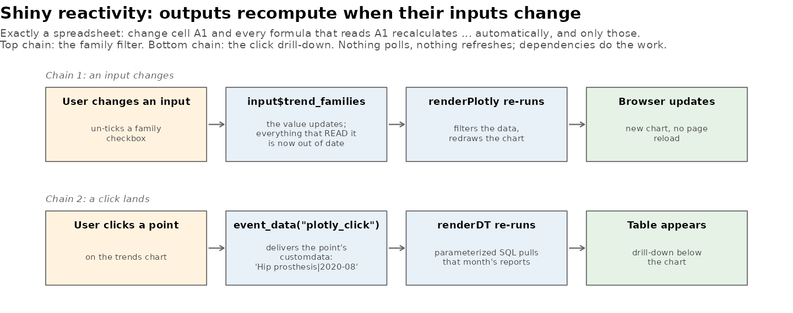

[← README](../README.md) · [All docs in order](../README.md#the-tutorial-in-order) · [Glossary](GLOSSARY.md)

# 07 — Phase 6: The Shiny dashboard — assembly

**Prerequisites:** Phases 1–5 complete; five tables in the database;
Phase 5 committed.
**Learning goal:** after this phase you will understand what a Shiny
app is, the UI/server split, reactivity (the spreadsheet model),
`input$`/`output$`, how a chart click becomes a database query, why
this app cannot live on GitHub Pages, and how to run and stop a local
web application.
**Why this phase exists in a real workflow:** everything so far
produces *artifacts* — figures, tables, pages. A surveillance team
needs an *instrument*: pick families, see the charts, and click from
a red dot straight to the reports behind it. That last move —
compute-on-click — is precisely what static pages can't do (Phase 3's
client-vs-server table said so), and precisely what this phase adds.

**The headline you've earned:** this dashboard contains **no new
statistics and no new charts.** The three panels are the exact
functions you built and tested in Phases 3–5
(`plot_trends_interactive`, `plot_top_signals_interactive`,
`plot_term_scatter_interactive`), reading the five tables your
scripts wrote. Phase 6 is assembly — the one-engine-many-consumers
design collecting its dividend.

**Session plan:**
- **Session A (~1.5 h):** concepts + steps 4.1–4.3 (install, read the
  app, launch it, work the Trends tab end to end).
- **Session B (~1–1.5 h):** steps 4.4–4.7 (Signals + Narratives
  drill-downs, tests, screenshot) + commit.

---

## 1. Concepts, plainly

**What Shiny is.** A Shiny app is a web page with a live R session
standing behind it. The page shows controls and charts; every
interaction travels to the R process, which recomputes whatever
depends on it and pushes the result back — no page reloads. That
standing R process is why Pages can't host it (Pages serves files;
nobody's R runs there) and why `runApp()` occupies your console while
the app lives.

**UI and server — the two halves of every app.** The `ui` object
declares WHAT exists: tabs, a checkbox group named
`"trend_families"`, a chart area named `"trend_plot"`. The `server`
function declares WHAT HAPPENS: how `output$trend_plot` is computed
from `input$trend_families`. The shared names are the wiring —
`checkboxGroupInput("trend_families", ...)` in the UI and
`input$trend_families` in the server are the same thing seen from two
sides.

**Reactivity — the spreadsheet model.** You already know this system:
change cell A1 in a spreadsheet and every formula that reads A1
recalculates — automatically, and *only those*. Shiny works
identically: `renderPlotly({...})` re-runs whenever anything it read
(`input$...`, a reactive) changes. You never say "when the checkbox
changes, redraw" — you write the recipe once; the dependency does the
scheduling:



**Clicks are inputs too.** The second chain in the figure: Phase 6
upgraded all three chart functions so every point carries
`customdata` — a string like `"Hip prosthesis|2020-08"` — and each
chart a `source` name. `plotly::event_data("plotly_click",
source = "trends")` hands the server the clicked point's customdata;
split it at the `|` and you know exactly which family and month to
query. That string is the entire bridge from pixel to database row.

**Drill-downs query live — with parameterized SQL.** The app loads
only the small result tables at startup. The 84K-row `clean_events`
stays in the database; every click runs a query with `?`
placeholders, values traveling separately from the SQL text
(`params = list(...)`). That separation is the standard defense
against SQL injection — a malicious or just weird string can never
rewrite the query — and it's good hygiene even locally, because apps
have a way of growing audiences.

**localhost and ports.** `runApp()` prints something like
`Listening on http://127.0.0.1:4321`. `127.0.0.1` (alias
`localhost`) means *this very machine* — the app is served from your
laptop to your laptop; nothing is on the internet. The number is a
**port**: one machine runs many network programs, and ports are the
numbered doors that keep them apart. Shiny picks a free one each
launch.

**What this phase is NOT.** Not deployment: putting the app on the
public web needs a server that runs R (e.g. shinyapps.io has a free
tier) — a documented roadmap item, deliberately out of scope. The
public face of the project remains the README + the three published
Pages charts; the app is the local instrument.

## 2. Get the Phase 6 files into your repo

| File | Goes in | Job |
|---|---|---|
| `app.R` | `app/` | The dashboard (UI + server, one file) — delete `app/.gitkeep` |
| `trending.R`, `signal_detection.R`, `text_mining.R` | `R/` (replace all three) | Click plumbing: `source` ids + customdata on every point; empty-input guards |
| `test-interactive_meta.R` | `tests/testthat/` | Pins the click plumbing (suite → 42) |
| `shiny_reactivity.png` | `docs/img/` | The diagram above |
| `make_illustrations.R` | `docs/img/` (replaces) | Now also generates it |

One-time install, in the Console:

```r
install.packages(c("shiny", "DT"))
renv::snapshot()
```

**Files-landed check** — three replaced engines, so the new-version
greps earn their keep (all validated against the real files):

```bash
ls app/app.R tests/testthat/test-interactive_meta.R docs/img/shiny_reactivity.png
grep -c 'source = "trends"'  R/trending.R          # expect 1
grep -c 'source = "signals"' R/signal_detection.R  # expect 1
grep -c 'source = "terms"'   R/text_mining.R       # expect 1
```

## 3. Run the app, step by step

### 4.1 Read before running

Open `app/app.R` and read it top to bottom once — it's one file,
heavily commented, and every concept from §1 is labeled where it
happens. Two structural things to notice: the **global section**
(everything above `ui`) runs once at startup — engines sourced,
small tables loaded, one database connection opened and scheduled
for cleanup with `onStop()`; and the `../` paths, because **Shiny
runs an app with the app's own folder as working directory** (a trap
this phase's own headless tests caught before it reached you).

### 4.2 Launch

In the Console, from the project root:

```r
shiny::runApp("app")
```

**You should see:** the console prints `Listening on
http://127.0.0.1:<port>` and *stays busy* (that's the live server —
the console belongs to the app until you stop it with the red STOP
button), and your browser opens the Overview tab: title, the three
tab descriptions, the honesty note, and your real report count.

**What it means:** a web application, served by your laptop to your
laptop, backed by your database. Click through all five tabs once
before going deeper.

### 4.3 The Trends tab, end to end

Un-tick two families — **you should see** the chart redraw instantly
with the remaining panels (chain 1 of the reactivity figure: nothing
was told to redraw; the dependency did it). Then click any flagged
point — **you should see** a title like *"Reports for Bone plate,
2020-08"* and a table of that month's first 15 reports appear below
(chain 2: click → customdata → parameterized query → table). That
red-dot-to-reports move is the whole reason this phase exists —
August 2020 is a good first click; you already know its story from
Phase 3.

### 4.4 The Signals tab

Drag the slider — the forest plot re-slices to top-N per family.
Click the top hip dot — **you should see** the reports mentioning
that problem, the drill-down that turns Phase 4's `a = 1012` from a
number into rows. (First click on any plotly chart in a session can
take a beat; that's the click listener attaching.)

### 4.5 The Narratives tab

Lower the rate slider and watch the scatter density change. Click a
dot far below the diagonal (`bhr` and `mandible` await) — **you
should see** up to three truncated narratives containing the word,
quoted below the chart: the counting-guides-reading-decides loop from
Phase 5, now one click long.

### 4.6 Tests

```bash
Rscript tests/run_tests.R
```

**You should see:** **four** contexts —
`interactive_meta, signal_detection, text_mining, trending` — and
`[ FAIL 0 | WARN 0 | SKIP 0 | PASS 42 ]`. The six new tests pin the
click plumbing: every chart's `source` id and the exact
`family|key` customdata format the server parses. If someone later
renames a source or reformats customdata, the suite — not a dead
drill-down — breaks the news.

### 4.7 The screenshot

The dashboard can't be published on Pages (§1), so the README shows
it as a picture: with the app open on the **Trends** tab and a
drill-down visible, take a screenshot (Cmd+Shift+4, drag over the
browser window) and save it as `figures/dashboard.png`.

## 5. Checkpoint

1. `runApp("app")` launches; all five tabs render with your real
   numbers (4.2).
2. All three drill-downs work: month click → reports; signal click →
   reports; word click → narratives (4.3–4.5).
3. Reactivity observed: family checkboxes and both sliders redraw
   their charts without any reload.
4. Tests: four contexts, 42 green (4.6).
5. `figures/dashboard.png` exists (4.7).
6. Stop the app (STOP button) — console returns; re-launch — works
   again (proves the `onStop` cleanup released the database).

## 6. Commit checkpoint

README edits:

1. Build log row 6 →
   `| 6 | [Shiny dashboard](docs/07-phase-6-shiny-dashboard.md) | ✅ |`
2. Results gallery — append after the Phase 5 block:

```markdown
### Phase 6 — The dashboard: from artifacts to instrument

The three interactive charts and five database tables assemble into
a Shiny app — same tested functions, now with what static pages
can't do: click any flagged month, signal, or word and the app
queries the database live for the reports behind it
(parameterized SQL, guarded reactivity, 42 tests).


The app runs locally (`shiny::runApp("app")`) — a live R server per
user is exactly what GitHub Pages can't host, which is why the
published charts above are static-interactive and the dashboard is
a picture. Deployment (e.g. shinyapps.io) is a documented roadmap
item.
```

Then the ritual:

```bash
git add .
git status   # both zones; expect app/app.R, three engines, new test,
             # both img files, doc, README, GLOSSARY, renv.lock,
             # figures/dashboard.png — and NO data/, NO Rplots.pdf
git commit -m "Phase 6: Shiny dashboard assembling the three tested charts with click-to-reports drill-downs; click plumbing pinned by tests (42)"
git push origin develop develop:beta develop:master
```

## 7. What could go wrong (mini-FAQ)

**`cannot open file 'R/trending.R'` on launch** — the app was started
with the wrong working directory. Use `shiny::runApp("app")` *from
the project root*, or RStudio's Run App button; the `../` paths in
app.R assume the app folder is the working directory (Shiny's rule).

**`could not find function "dataTableOutput"` / DT errors** — the
one-time `install.packages(c("shiny","DT"))` + `renv::snapshot()`
hasn't happened in this project library.

**The app launches but a tab is blank** — almost always the database:
the app expects all five tables. `dbListTables()` in a fresh Console
should list clean_events, monthly_trends, narrative_terms,
raw_events, signal_stats; anything missing means its phase's final
write step didn't run.

**Clicking does nothing** — three usual causes, in order: you haven't
clicked yet this session (drill-downs are empty by design until the
first click — that's `req()` politely waiting); the first click on a
fresh chart needs a beat to attach; or you clicked empty space —
aim at a point.

**`Listening on...` but no browser opens** — copy the printed
127.0.0.1 URL into the browser yourself; some setups don't auto-open.

**Port already in use** — a previous app instance is still running;
press STOP in the old session (or restart R) and launch again.

**Console seems frozen** — it isn't; it's serving the app. That's
the deal: one console, one job. STOP returns it.

**`database is locked`** — an analysis script's connection is still
open in another session; close it or restart that R.

## 8. Two ways to run everything (running tally)

| Capability | Manual path | App path |
|---|---|---|
| Trend inspection | `analysis/02_trending.R`, saved figures | Trends tab + month drill-down |
| Signal review | `analysis/03_signal_detection.R` | Signals tab + report drill-down |
| Narrative reading | `analysis/04_text_mining.R` missions | Narratives tab + word drill-down |
| Verify everything | `Rscript tests/run_tests.R` (42) | same suite guards the app's plumbing |

---

**Next:** `08-phase-7-pipeline-report.md` — the last construction
phase: a reproducible Quarto report that re-tells the whole analysis
from the database, and a one-command pipeline that reruns everything
— fetch → load → clean → trend → signals → terms → tests — proving
the reproducibility the README has been promising all along.
