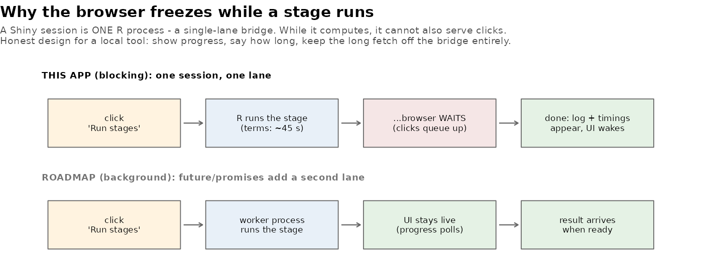

[← README](../README.md) · [All docs in order](../README.md#the-tutorial-in-order) · [Glossary](GLOSSARY.md)

# 09 — Phase 8: Mission Control — from dashboard to workbench

**Prerequisites:** Phases 1–7 complete; the pipeline runs green; the
report publishes.
**Learning goal:** after this phase you will understand the
difference between a dashboard and a workbench, what "blocking" means
in a web app (and why honest tools design around it instead of
hiding it), how a read-only SQL console is made safe *by
construction*, and how an app refreshes its own state after changing
the data underneath itself.
**Why this phase exists in a real workflow:** the dashboard answers
"what did the analysis find?" A surveillance *team* also needs "run
this month's refresh", "let me just query the table", and "give me
the report" — without leaving the tool. Phase 7 built every one of
those capabilities as callable functions precisely so this phase
could put buttons on them. **The whole phase is one sentence long:
the UI wraps the pipeline.** Everything else is honest engineering
around that sentence.

**Session plan:**
- **Session A (~1.5 h):** concepts + steps 4.1–4.3 (files in, read
  the diff, Pipeline tab end to end).
- **Session B (~1–1.5 h):** steps 4.4–4.6 (Query console, Report
  tab, tests) + screenshot + commit.

---

## 1. Concepts, plainly

**Dashboard vs. workbench.** A dashboard *shows* results; a
workbench *runs the work*. Same app, same file — three new tabs:
**Pipeline** (run stages from the browser), **Query** (ask the
database anything, safely), **Report** (render and publish on
demand). The five analysis tabs are untouched — they just learned
one new trick (below).

**Blocking, honestly.** A Shiny session is ONE R process — a
single-lane bridge. While it computes a stage, it cannot also serve
clicks; the browser waits, and anything you click queues up until
the lane clears:



Grown-up tools don't pretend otherwise — they design around it: the
Pipeline tab shows a progress bar with the current stage's name,
states the costs up front (terms ~45s, probe ~1min, report ~20s),
and **deliberately does not offer the full fetch** — a 30-minute
credentialed download does not belong behind a button that freezes a
browser; it stays Terminal territory
(`Rscript run_pipeline.R all`), and the tab says so. The *real*
second lane — a worker process via `future`/`promises`, so the UI
stays live during long work — is the documented production pattern
on the roadmap, named rather than half-built.

**The UI wraps the pipeline — literally.** Press Run and the app
calls the *same* `PIPELINE_STAGES` functions the Terminal runner
calls, in the same canonical order, with the same stop-on-error
rule, streaming each stage's status lines into an on-screen log and
collecting the same timing table. No logic was moved into the app;
none ever should be. (This is Phase 7's design rule collecting its
dividend: the tab is ~60 lines, and most of them are progress
plumbing.)

**Read-only by construction: two locks.** The Query tab runs ad hoc
SQL — a gift and a hazard, since one careless statement could
rewrite the database. The engine (`R/console.R`, tested before the
UI existed) uses **defense in depth**: Lock 1 *validates the text* —
a single SELECT (or WITH) only; forbidden keywords (INSERT, UPDATE,
DELETE, DROP, PRAGMA, ATTACH...) refused with a reason; no
semicolon-smuggled second statement. Lock 2 *opens the connection
read-only* — SQLite's own RO flag, so even a statement that somehow
slipped Lock 1 cannot write. Either lock alone would suffice; both
together mean a bug in one still leaves you safe. The tests prove
both: the validator's refusals, AND that a direct write attempt on
the RO connection fails at the database itself. Results cap at 200
rows (fetched as 201, so truncation is *detected*, never guessed).

**State that refreshes.** The Pipeline tab can change the very
tables the dashboard tabs display — so those tabs' data now lives in
a `reactiveVal` filled by one loader function, and a **Reload
results** button swaps in fresh tables; every chart that read them
recomputes. The spreadsheet model, one level up: the app's own data
is now a cell.

## 2. Get the Phase 8 files into your repo

| File | Goes in | Job |
|---|---|---|
| `app.R` | `app/` (replaces) | +Pipeline, +Query, +Report tabs; refreshable state |
| `console.R` | `R/` | The query console's two locks (engine) |
| `test-console.R` | `tests/testthat/` | Pins both locks (suite → 63) |
| `run_tests.R` | `tests/` (replaces) | Now sources console.R |
| `blocking_single_lane.png` | `docs/img/` | The figure above |
| `make_illustrations.R` | `docs/img/` (replaces) | Now also generates it |

**Files-landed check** (validated):

```bash
ls R/console.R tests/testthat/test-console.R docs/img/blocking_single_lane.png
grep -c "tabPanel(\"Pipeline\"" app/app.R      # expect 1
grep -c "SQLITE_RO" R/console.R               # expect 1
grep -c 'source("R/console.R")' tests/run_tests.R   # expect 1
```

## 3. Use Mission Control, step by step

### 4.1 Read the diff, not the whole file

You know most of `app/app.R` already. New since Phase 6, in reading
order: the extra `source()` lines (console + pipeline — the app
imports the API), `load_small_tables()` + the `MC_STAGES` note
(fetch's absence is a decision, commented), the three new
`tabPanel`s, and in the server: `DATA <- reactiveVal(...)`, the
`mc_run` observer (the pipeline loop with progress + log capture),
the query handlers (both locks called, never reimplemented), and the
report button. ~15 minutes.

### 4.2 Launch and run the pipeline from the browser

```r
shiny::runApp("app")
```

Open **Pipeline**. Default ticks: `trend`, `signals`, `test` — a
~20-second run. Press **Run selected stages**. **You should see:**
the progress bar stepping through stage names while the browser
waits (the single-lane bridge, felt once and understood forever),
then the run log —

```
[trend] monthly_trends: 240 rows; 152 flagged
[signals] signal_stats: 312 pairs; 64 Evans signals
[test] suite green
```

— and the timing table. **What it means:** the same pipeline, same
numbers, same gate — from a button. Then tick `terms` and run again
if you want to feel a 45-second block with the progress bar naming
the culprit.

### 4.3 Reload

Press **Reload results into dashboard** — a notification confirms,
and the Trends/Signals/Narratives tabs now read the just-written
tables. (With identical inputs the charts look identical — the
point is the *mechanism*; it matters the day a run changes things.)

### 4.4 The Query console

Open **Query**. The schema panel lists every table and column — your
database, self-describing. Run the pre-filled query. **You should
see:** `4 row(s).` and the family counts — 33,834 / 30,754 / 11,097
/ 8,852 (+ Other 10 if you query it). Then try your own; three worth
typing:

```sql
SELECT year_month, n, status FROM monthly_trends
WHERE device_family = 'Spinal fixation' AND status != 'within limits'
ORDER BY n DESC
```

```sql
SELECT product_problem, a, ROUND(prr,1) AS prr FROM signal_stats
WHERE evans_signal = 1 AND device_family = 'Hip prosthesis'
ORDER BY prr DESC
```

And the locks, on purpose: run `DELETE FROM clean_events` — **you
should see** `Refused: only SELECT queries are allowed here` and,
below it, your data untouched. That refusal message is Lock 1;
Lock 2 sits behind it, tested, in case Lock 1 ever grows a hole.

### 4.5 The Report tab

Press **Render & publish report**. ~20 seconds of honest blocking,
then the green confirmation: fresh HTML in `docs/`, plus a link to
the live (last-pushed) version. The report's numbers are whatever
the database holds *right now* — the executable-document promise,
now one button away from any pipeline run.

### 4.6 Tests

```bash
Rscript tests/run_tests.R
```

**You should see:** **six** contexts — `console, interactive_meta,
pipeline, signal_detection, text_mining, trending` — and
`[ FAIL 0 | WARN 0 | SKIP 0 | PASS 63 ]`.

## 5. Checkpoint

1. Pipeline tab: trend+signals+test run from the browser, log +
   timings shown (4.2).
2. Reload button refreshes the dashboard tabs (4.3).
3. Query console: your own SELECT works; `DELETE` is refused (4.4).
4. Report tab renders and publishes (4.5).
5. Suite: six contexts, 63 green (4.6).
6. Screenshot: **Pipeline tab after a run** (log + timings visible)
   saved as `figures/mission_control.png`.

## 6. Commit checkpoint

README edits (build-log row + gallery + tree) are done for you —
verify: `grep -c "docs/09-phase-8-mission-control.md" README.md` → 1.

```bash
git add .
git status   # expect: app/app.R, R/console.R, test-console.R,
             # run_tests.R, doc 09, both img files, GLOSSARY, README,
             # figures/mission_control.png — no data/, no report/*.html
git commit -m "Phase 8: Mission Control - pipeline, read-only query console (two tested locks), and report tabs; the UI wraps the pipeline; tests to 63"
git push origin develop develop:beta develop:master
```

## 7. What could go wrong (mini-FAQ)

**The whole app freezes during a run** — yes: the single-lane
bridge (§1). The progress bar names the stage; wait it out. If it
bothers you, that's the roadmap's `future`/`promises` item earning
its place.

**`database is locked` when running a stage from the app** — another
process holds a write lock (an analysis script's open connection, or
a Terminal pipeline mid-run). One writer at a time; close the other,
rerun.

**Query refused and I think it shouldn't be** — the console accepts
exactly one SELECT/WITH statement, nothing else — no semicolons
inside, no PRAGMA. That's the contract, not a bug; run anything else
in an R script where changes are visible and versioned.

**Report button fails with "quarto binary not found"** — same
fallback as Phase 7: RStudio's Render button; the FAQ entry there
covers PATH.

**I ran `load` from the app and the log is huge** — the loader
prints one line per raw file (95 of them). Harmless; the log pane
scrolls.

**After a run the dashboard looks unchanged** — did you press
Reload? State swaps only when asked (deliberate: mid-analysis, you
choose when the ground moves under you).

## 8. Two ways to run everything — final form

| Capability | Terminal | Mission Control |
|---|---|---|
| Probe / load / clean / analyses / test | `Rscript run_pipeline.R ...` | Pipeline tab (tick + Run) |
| Full fetch | `Rscript run_pipeline.R all` | deliberately Terminal-only (§1) |
| Ad hoc SQL | R script / `sqlite3` | Query tab (read-only, two locks) |
| Render + publish report | `Rscript run_pipeline.R report` | Report tab (one button) |
| Explore results | `runApp` → 5 tabs | same app, same tabs, reloadable |

One pipeline underneath all of it — which was the entire design.

---

**Next:** `10-phase-8b-scoped-ingestion-data-access.md` — scoped
ingestion and full data access; after it, the finale: README polish,
release notes, the honest roadmap (deployment, background execution,
rolling baselines), and the repo declared 1.0.
