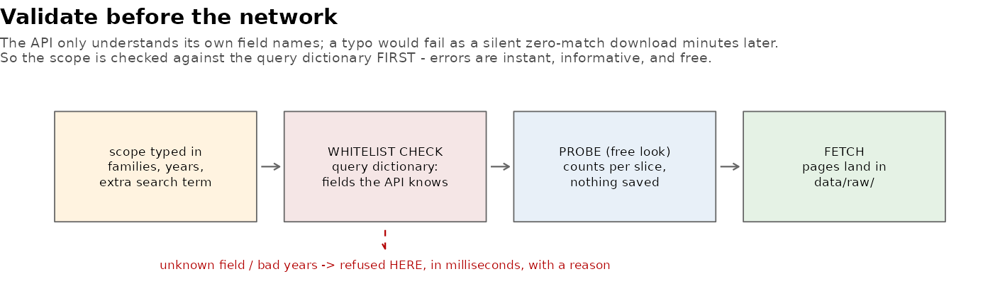

[← README](../README.md) · [All docs in order](../README.md#the-tutorial-in-order) · [Glossary](GLOSSARY.md)

# 10 — Phase 8b: Scoped ingestion & data access

**Prerequisites:** Phase 8 committed; Mission Control working.
**Learning goal:** after this phase you will understand how a real
API constrains what you may ask it (and why a *query dictionary* +
*validate-before-network* is the professional answer), how one scope
definition travels UI → config → CLI → API, and the trade-offs
between CSV, Excel, and JSON as export formats.
**Why this phase exists in a real workflow:** an instrument whose
data intake is hardcoded serves exactly one question. Real tools let
the user say *what* to ingest — and real tools also let the data
back OUT: analysts live in spreadsheets, engineers in JSON, and
everyone eventually asks "can I just download that?" This phase adds
both doors.

**Session plan:** one session (~1.5–2 h): files in → read → Ingest
tab (probe a scope, fetch a small one) → Data tab (browse, filter,
download) → tests → commit.

---

## 1. Concepts, plainly

**APIs only understand their own vocabulary.** openFDA search runs
on *its* field names — `device.brand_name`, `product_problems`,
`mdr_text.text` — and nothing else. Ask it about a field it doesn't
know and you don't get a helpful error; you get silence (zero
matches) after a wasted call. So the project now carries a **query
dictionary**: the whitelist of fields this pipeline accepts, each
with its meaning and a working example — shown as a table right on
the Ingest tab, enforced in code on BOTH sides of the R↔Python seam
(the app refuses instantly; the script re-validates anyway —
defense in depth, third appearance).



**One scope, four carriers.** The thing you type — families ×
years × optional extra term — travels as a single scope through
four forms: UI inputs → config fields (`fetch_families`,
`fetch_year_from/to`, `fetch_search`) → CLI arguments
(`--families`, `--year-from`, `--year-to`, `--search`) → the API
search expression. `build_fetch_args()` is the tested seam, and the
script's new `--dry-run` prints exactly what any scope resolves to,
**without any network** — try it in the Terminal:

```bash
python ingest/fetch_maude.py --dry-run --families hip_prosthesis \
  --year-from 2023 --year-to 2024 --search 'product_problems:"Corroded"'
```

**Scoped fetches EXTEND data/raw.** New pages land beside the old
ones (extra-search fetches carry a `_q` tag in the filename); the
`load` stage reads *everything present*, and Phase 2's dedup handles
overlaps by report_number. So a scoped fetch is additive — useful
for "top up 2025 when it exists" or "pull the corroded subset" —
while the honest full-refresh remains the Terminal's
`Rscript run_pipeline.R all`. (Fetching genuinely *new device
categories* — shoulders, ankles — additionally needs the family
classifier extended in `R/clean_events.R`; that's the documented
edit, not a button, because classification is a judgment.)

**Three export formats, three audiences.** **CSV** — plain text,
one row per line: universal, opens everywhere, no structure beyond
the table. **Excel (.xlsx)** — the format your stakeholders
actually double-click; typed columns, ready to filter. **JSON** —
structured text for programs and web apps; what APIs speak. The
Data tab serves all three, always with EVERY row and column —
including the narratives the on-screen table hides for size.

## 2. Get the Phase 8b files into your repo

| File | Goes in | Job |
|---|---|---|
| `fetch_maude.py` | `ingest/` (replaces) | Query dictionary + validated CLI scope + `--dry-run` |
| `config.R`, `stages.R` | `pipeline/` (replace) | Scope fields; R-side validator; args builder; captured fetch output |
| `app.R` | `app/` (replaces) | +Ingest tab, +Data tab (browse/filter/download) |
| `test-pipeline.R` | `tests/testthat/` (replaces) | +9 scope expectations (suite → 72) |
| `validate_before_network.png` | `docs/img/` | The figure above |
| `make_illustrations.R` | `docs/img/` (replaces) | Now also generates it |

One-time install: `install.packages("writexl")` then
`renv::snapshot()` (tiny package; writes real .xlsx without Java or
Excel).

**Files-landed check** (validated):

```bash
grep -c "SEARCHABLE_FIELDS" ingest/fetch_maude.py     # expect 6
grep -c "validate_fetch_scope" pipeline/stages.R      # expect 2
grep -c 'tabPanel("Ingest"' app/app.R                 # expect 1
grep -c 'tabPanel("Data"' app/app.R                   # expect 1
python ingest/fetch_maude.py --dry-run | head -2      # prints the default scope
```

## 3. Use it, step by step

### 4.1 The Ingest tab

Relaunch (`shiny::runApp("app")` — STOP first if running; Shiny
reads app.R only at launch). Open **Ingest**. The query dictionary
sits on the right — the searchable fields, meanings, examples.

**Feel the validation first** (free, instant): set From year 2024,
To year 2020 → **Probe** → red *"Invalid scope: year range …"*. Type
`bogus_field:xyz` in the search box → **Probe** → red *"unknown
field(s): bogus_field — searchable: …"*. No network happened; the
figure's dashed red arrow, live.

**Then a real probe** (venv active; needs the API key exported in
the environment RStudio inherited): bone_plate, 2024–2024, search
term empty → **Probe** → the log shows the slice count (~2,409 —
matching your Phase 7 probe). Add
`product_problems:"Corroded"` → **Probe** again → a much smaller
count: the extra clause narrowing in action.

### 4.2 A scoped fetch (optional today; know the move)

**Fetch this scope** on a one-family-one-year scope downloads its
pages into `data/raw/` (blocking ~1–3 min; progress bar names it).
Afterwards: Pipeline tab → tick `load clean trend signals test` →
Run → Reload. That's the full user story you asked for — *specify
ingestion parameters, run the pipeline end to end* — inside the app.
(Your current raw files already cover 2020–2024, so today's fetch
would re-download existing reports — harmless, dedup eats them, but
nothing new appears. The move matters the day 2025 data or a subset
question does.)

### 4.3 The Data tab

Pick `monthly_trends` — the table renders with **filter boxes under
every header** (type `above` under status; sort by n descending: the
spinal 776 tower surfaces again). Pick `clean_events` — 84,547 rows
browse smoothly *because* the narrative column stays server-side
(the title and helptext say so). Then the downloads: **CSV / Excel /
JSON** of the full selected table (big ones take a moment —
narratives included), any **figure** as PNG, and the **report**
HTML. Every artifact the project makes now leaves through a button.
(For interactive charts, the camera icon in their toolbar saves
exactly what you're looking at — already there all along.)

### 4.4 Tests

```bash
Rscript tests/run_tests.R
```

**You should see:** six contexts, `[ FAIL 0 | WARN 0 | SKIP 0 |
PASS 72 ]` — the nine new expectations pin the scope validator's
refusals and the config→CLI argument builder.

## 5. Checkpoint

1. Ingest tab: both invalid scopes refused with reasons (4.1).
2. A real probe returns counts for a small scope (4.1).
3. Data tab: filter + sort work; one CSV and one Excel download
   open correctly (4.3).
4. Report downloads from the Data tab (4.3).
5. Suite: 72 green (4.4).
6. Screenshot: the **Ingest tab** with the dictionary and a probe
   result visible → `figures/ingest_tab.png`.

## 6. Commit checkpoint

README edits are done for you — verify:
`grep -c "docs/10-phase-8b" README.md` → 1.

```bash
git add .
git status   # expect: ingest/fetch_maude.py, pipeline/ (2), app/app.R,
             # test-pipeline.R, doc 10, both img files, GLOSSARY, README,
             # renv.lock (writexl), figures/ingest_tab.png — no data/
git commit -m "Phase 8b: scoped ingestion (query dictionary, validate-before-network, dry-run) + Data tab with filter/sort and CSV/Excel/JSON/figure/report downloads; tests to 72"
git push origin develop develop:beta develop:master
```

## 7. What could go wrong (mini-FAQ)

**Fetch fails with 403s and `NOTE: no OPENFDA_API_KEY set`** — the
key was exported in a Terminal session, but environment variables are
inherited *at process birth, from the parent*: RStudio (launched from
the Dock) never saw your Terminal's export, so neither did the Python
it spawns. The R-native fix: put the key in a project `.Renviron`
file (`OPENFDA_API_KEY=...`), which R reads at every session start
and passes to child processes — and **gitignore `.Renviron`
immediately**; a secret must never enter Git. Restart R, verify with
`nchar(Sys.getenv("OPENFDA_API_KEY")) > 0`, relaunch. (A probe can
succeed anonymously while a fetch 403s — count queries slip past
bot-detection more easily than paged downloads; same Phase 1 story.)

**`runApp("app")` says "No Shiny application exists at the path
'app'"** — the working directory is probably stranded *inside*
`app/` (check `getwd()`), a leftover from an earlier session where a
handler that had stepped up to the project root was interrupted
before restoring. Fix: `setwd()` back to the project root and
relaunch. The app now registers its directory-restore *before*
changing directory (`on.exit` first, `setwd` second — cleanup
scheduled before the mess is possible), so current versions cannot
strand it again.

**Probe/fetch errors mentioning the venv** — the load/fetch stages
run Python; if the traceback path shows `.venv/`, the venv is fine
and the problem is elsewhere (usually the key, above). Terminal test:
`python ingest/fetch_maude.py --probe --families bone_plate --year-from 2024 --year-to 2024`.

**My search term is refused but looks right** — the field must be
one of the seven in the dictionary, spelled exactly (dots matter:
`device.brand_name`, not `brand_name`). Values with spaces need
quotes: `product_problems:"Material Erosion"`.

**A probe count is 0** — a valid scope with no matches (e.g. a brand
name that never appears in that family-year). Zero is an answer,
not an error — that's why the probe exists.

**A download saves as `.html` (e.g. `dl_xlsx.html`)** — you're
downloading from RStudio's preview window, which mishandles download
endpoints. Click **Open in Browser** (top-left of that window) and
download from a real browser — correct name, correct format. The
preview window is for previewing; browsers are for downloads.

**After a scoped fetch, the pipeline's totals CHANGED** — the load
stage reads every file in `data/raw/`, so a change means files
changed: a lower total = a page file lost or clobbered. Diagnose
with your own Query console —
`SELECT source_file, COUNT(*) FROM raw_events GROUP BY source_file
ORDER BY source_file` — and look for a family-year whose pages don't
add up. Recovery: refetch just that slice from the Ingest tab with
the search box EMPTY (untagged, rewrites the standard page files),
then rerun load → clean → analyses; the printed counts should return
to their known values. This is the pipeline's counts doing their
job: numbers that move without a reason are the alarm.

**The Excel download of clean_events is slow** — 84K rows with full
narratives is tens of MB; writexl needs a moment. The progress
cursor is honest; CSV is faster for big tables.

**I fetched a scope and the dashboard didn't change** — fetching
only lands raw pages. Run `load → clean → …` on the Pipeline tab,
then Reload — the tab's helptext walks it.

**Filter boxes don't appear** — they're under the column headers on
the Data tab (`filter = "top"`); drill-down tables elsewhere stay
minimal by design.

## 8. Two ways to run everything — with data access

| Capability | Terminal | App |
|---|---|---|
| Scoped probe / fetch | `python ingest/fetch_maude.py --families ... --probe` | Ingest tab |
| Dry-run a scope | `... --dry-run` | (Terminal only — a developer's tool) |
| Browse any table | `sqlite3` / R | Data tab (filter + sort) |
| Export table / figure / report | file system | Data tab download buttons |

---

**Next:** `11-phase-9-packaging.md` *(arrives with Phase 9)* — the
finale: README polish,
release notes, the honest roadmap, 1.0.
