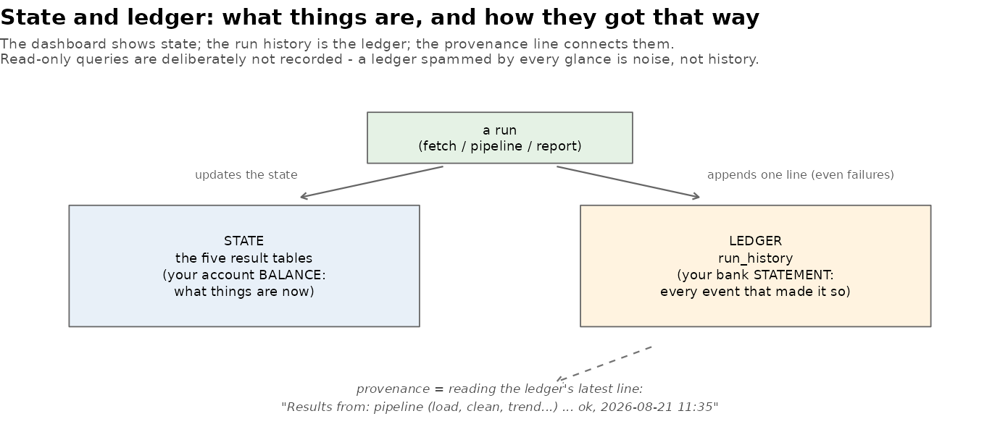

[← README](../README.md) · [All docs in order](../README.md#the-tutorial-in-order) · [Glossary](GLOSSARY.md)

# 11 — Phase 8c: Provenance & run history

**Prerequisites:** Phase 8b committed; the refresh drill behind you.
**Learning goal:** after this phase you will understand the state /
ledger distinction (and why serious systems keep both), what
*provenance* means for data results, why failures belong in a
history, and why "select an old run and see its results" is a bigger
promise than it sounds.
**Why this phase exists in a real workflow:** the drill exposed the
gap. After a run you asked, reasonably: *is this tab showing the new
results or the old ones? which run produced what I'm looking at?*
An instrument that changes its own data owes its user those answers
— automatically, not by memory.

**Session plan:** one short session (~45–60 min): files in → read →
watch the three behaviors → checkpoint → commit.

---

## 1. Concepts, plainly

**State vs ledger.** Your bank account has a *balance* (what things
are now) and a *statement* (every event that made it so). This
project's five result tables are its balance; the new `run_history`
table is its statement. Neither replaces the other: state answers
"what?", the ledger answers "how did it get this way?"



**Provenance is reading the ledger's latest line.** The Overview tab
now carries one quiet sentence — *"Results from: pipeline (load,
clean, …) — ok, 2026-08-21 11:35"* — and that sentence is the whole
feature: every chart on every tab is now *attributed*. Before any
recorded run it says so honestly ("results are from the database as
found at startup").

**What gets recorded — and what doesn't.** The consequential events:
probes and fetches (they spend API budget), pipeline runs (they
change state), report renders (they publish). Each row: when, what
kind, the scope or stage list, ok/error, a summary of the key output
lines, duration. **Failures are recorded on purpose** — an honest
ledger keeps its bad days; yesterday's 403s would have been rows
here, and the incident's timeline would have written itself.
Read-only queries are deliberately *not* recorded: a ledger spammed
by every glance is noise, not history.

**The ledger lives in the database** — not in app memory. It
survives restarts, both doors write to it (app runs *and* Terminal
`run_pipeline.R` runs), and — a pleasing symmetry — you can study it
with your own Query tab: `SELECT * FROM run_history ORDER BY run_at
DESC`.

**Auto-refresh closes the loop.** A Pipeline-tab run that succeeds
now refreshes the dashboard tables itself — no Reload press. The
Reload button remains for the one case automation can't see: the
database changed *outside* the app (a Terminal pipeline run while
the app was open).

**What this phase deliberately does NOT do** — and the design it
sketches instead. Selecting an old run and seeing *its* results
everywhere means **versioned result sets**: every run writing
`monthly_trends_run17`-style copies (or one table with a `run_id`
column), every query and chart filtering by the selected run,
storage growing per run, and a retention policy. Real systems do
exactly this — it is the natural next storey, and the run-ids in
today's ledger are its foundation — but it touches every query in
the app and both consumers of every table, so it is roadmap, not a
patch. Its sibling is **background execution** (`callr`/`future`):
a worker process runs long stages while the UI stays live and
streams the log — the single-lane bridge's second lane, which would
also make *live* logs possible. Ledger + versioned results +
background workers = a real job system; this phase builds the first
pillar properly.

## 2. Get the Phase 8c files into your repo

| File | Goes in | Job |
|---|---|---|
| `run_history.R` | `R/` | The ledger engine (record + read, tested) |
| `test-run_history.R` | `tests/testthat/` | Pins the ledger's contract (suite → 79) |
| `run_tests.R` | `tests/` (replaces) | Sources the ledger |
| `app.R` | `app/` (replaces) | Provenance line, history table, recording, auto-refresh; absolute DB path |
| `run_pipeline.R` | project root (replaces) | Terminal runs record too — success and failure |
| `state_vs_ledger.png` | `docs/img/` | The figure above |
| `make_illustrations.R` | `docs/img/` (replaces) | Now also generates it |

**Files-landed check** (validated):

```bash
ls R/run_history.R tests/testthat/test-run_history.R docs/img/state_vs_ledger.png
grep -c "record_run" app/app.R          # expect 3
grep -c "record_run" run_pipeline.R     # expect 2
grep -c "normalizePath" app/app.R       # expect 1
```

## 3. Watch the three behaviors, step by step

### 4.1 Provenance, before and after

Relaunch (`shiny::runApp("app")` — STOP first). **Overview** shows
the honest pre-run line: *"No recorded runs yet…"*. Now **Pipeline**
tab → tick just `trend` → **Run** (~3s). **You should see**, without
touching anything else: the notification *"Run recorded; dashboard
refreshed."* — and back on **Overview**, the provenance line now
names your run, stages and timestamp. That sentence updating is
Phase 8c working.

### 4.2 The history

Still on **Pipeline**: below Timings, the **Run history** table now
holds your run — kind, detail, outcome, summary of the key lines,
seconds. Run a **Probe** from the Ingest tab (any small scope);
return: two rows, newest first. Restart the app entirely; the rows
are still there — the ledger lives in the database, not the
session. (Prove the symmetry: **Query** tab →
`SELECT * FROM run_history` — your history, queryable like any
other table, because it *is* one.)

### 4.3 Auto-refresh, felt

Pipeline → tick `trend signals test` → **Run** → watch the
notification arrive at completion — no Reload press, and the
dashboard tabs already hold the fresh tables. The Reload button's
helptext now states its remaining purpose: database changes made
*outside* the app.

### 4.4 Tests

```bash
Rscript tests/run_tests.R
```

**You should see:** **seven** contexts — `console, interactive_meta,
pipeline, run_history, signal_detection, text_mining, trending` —
and `[ FAIL 0 | WARN 0 | SKIP 0 | PASS 79 ]`.

## 5. Checkpoint

1. Provenance line: honest before any run; names the run after
   (4.1).
2. History table populated, newest first; **survives an app
   restart**; readable from the Query tab (4.2).
3. A pipeline run refreshes the dashboard with no Reload press
   (4.3).
4. Suite: seven contexts, 79 green (4.4).
5. Screenshot: the **Pipeline tab** with run log, timings, and the
   history table visible → `figures/run_history.png`.

## 6. Commit checkpoint

README edits are done for you — verify:
`grep -c "docs/11-phase-8c" README.md` → 1.

```bash
git add .
git status   # expect: R/run_history.R, its test, run_tests.R,
             # app/app.R, run_pipeline.R, doc 11, both img files,
             # GLOSSARY, README, figures/run_history.png — no data/
git commit -m "Phase 8c: run-history ledger (both doors record, failures kept), provenance line, auto-refresh after runs; absolute DB path; tests to 79"
git push origin develop develop:beta develop:master
```

## 7. What could go wrong (mini-FAQ)

**I fetched one family / ran one stage — why does the dashboard
still show all four families?** — three different "scopes" answer
three different questions. *Fetch scope* (Ingest tab) is what to
DOWNLOAD — additive; fetching one family removes nobody else from
the cumulative database. *Analysis scope* (the config: all four
families) is what the stages COMPUTE over — ticking stages picks
which computations run, not which data subset; `trend` always
recomputes over the whole database. *Display scope* (the tab
controls — the Trends family checkboxes) is what you LOOK at, and
defaults to everything, because a surveillance instrument's default
view is "everything under watch." Results computed from only a
chosen slice, switchable per run, is exactly the versioned-result-
sets design on the roadmap (§1).

**The history is empty on a fresh clone** — correct: a new user has
no history, and the provenance line says so. History is earned, not
shipped.

**My Terminal pipeline run doesn't show in the open app's history**
— the app reads the ledger after *its own* runs; for outside runs,
press **Reload** (its exact remaining job) or reopen the Pipeline
tab.

**I want the ledger cleared** — it's a table; but consider *why*
before deleting history whose entire purpose is remembering. (If
truly needed: it's the one deliberate exception to look-don't-touch
— from an R script, not the read-only console, which will refuse.)

**An error row appeared** — working as designed: failures are
history too. The summary column carries the error message; that row
is tomorrow's diagnosis shortcut.

**Timestamps look off** — they're your Mac's local time at record
moment, by design (a personal instrument logs in its user's clock).

## 8. Two ways to run everything — now with memory

| Capability | Terminal | App |
|---|---|---|
| Run stages | `Rscript run_pipeline.R ...` (records) | Pipeline tab (records + auto-refreshes) |
| See what ran | Query the ledger / app | Run history table + provenance line |
| Attribute results | `SELECT * FROM run_history` | the Overview provenance line |

---

**Next:** `12-phase-9-packaging.md` *(arrives with Phase 9)* — the
finale: README polish, release notes, the honest roadmap
(deployment, background execution, versioned result sets, rolling
baselines), and 1.0.
