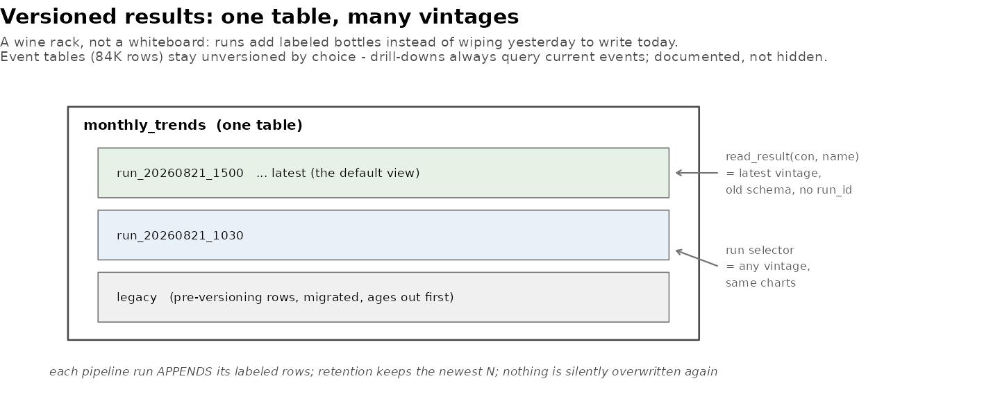

[← README](../README.md) · [All docs in order](../README.md#the-tutorial-in-order) · [Glossary](GLOSSARY.md)

# 12 — Phase 8d: Runs as first-class citizens — versioned results

**Prerequisites:** Phase 8c committed (the ledger exists).
**Learning goal:** after this phase you will understand result
versioning (one table, many vintages), schema migration in place,
retention policies, why the event tables deliberately stay
unversioned, and idempotent writes.
**Why this phase exists in a real workflow:** you asked the right
question three times: *"I ran something — why don't the charts show
MY run?"* Until now, every pipeline run silently overwrote its
predecessor: yesterday's results were destroyed to make today's.
Real analytical systems don't work that way — they keep vintages, so
"what did last month's run say?" is a selection, not an excavation.
The 8c ledger recorded that runs happened; 8d keeps what they
produced.

**Session plan:** one session (~1 h): files in → read → watch two
vintages exist at once → switch between them → downloads → commit.

---

## 1. Concepts, plainly

**One table, many vintages.** The three result tables
(`monthly_trends`, `signal_stats`, `narrative_terms`) gain a
`run_id` column. Each pipeline run APPENDS its rows, labeled with
its id — a wine rack, not a whiteboard: runs add labeled bottles
instead of wiping yesterday to write today.



**Run ids sort by themselves.** `run_20260821_150000` — a timestamp
in the name, so plain string ordering IS chronological ordering.
Every "latest vintage" query is just `MAX(run_id)`.

**Migration in place, nothing lost.** The first versioned write to a
pre-8d table adds the `run_id` column and labels every existing row
`'legacy'` — your current results become the founding vintage
rather than casualties.

**Idempotent per run.** Writing a vintage first deletes any rows
with the SAME id, then appends — so rerunning a stage within one run
replaces its own vintage only, never its neighbors'. (Idempotent:
doing it twice equals doing it once — the property that makes
retries safe.)

**Retention.** `keep_runs = 10` in the config: each table keeps its
newest ten vintages; older ones (including `legacy`, eventually) age
out. Deliberate forgetting, on a schedule, instead of accidental
forgetting on every run — or a database growing forever.

**What stays unversioned, and why.** The event tables
(`raw_events`, `clean_events`, 84K rows each) are *inputs*, not
results — versioning them would add ~170K rows per run for no
analytical gain. Consequence, stated honestly: **click drill-downs
always query the CURRENT events**, even while viewing an older
vintage's charts. For same-data reruns (the normal case) this is
invisible; after a data refresh, an old vintage's charts pair with
new events underneath — the provenance line and ledger tell you
exactly when that's so.

**Analysis scope: the run computes what you choose.** The Pipeline
tab's new *Analysis scope* panel (families + year range) sets what a
run COMPUTES over — not just what gets downloaded (that's the Ingest
tab) or what you look at (the chart checkboxes), but the actual
slice the statistics run on. A spinal-2024 run produces a vintage
containing *only* spinal 2024; select it and every chart shows
exactly that, with the family checkboxes following the vintage. The
selector's menu labels every run with its recorded scope. The three
scopes finally meet: download scope (Ingest), compute scope
(Pipeline), display scope (charts) — each settable, each honest.

**Comparative statistics need a comparison.** Trend charts stand
alone — each family against its own history. But signals and
distinctive terms are *comparative*: a family measured against all
the OTHER families (the 2×2 table's b and d columns ARE the
others). One family in scope means there is no "everyone else" —
zero signals and zero distinctive vocabulary is then the *correct*
answer, not a failure. The app handles this honestly: a
single-family run **skips** the comparative stages with a log line
saying why, and the Signals/Narratives tabs explain the requirement
instead of erroring when a vintage has no comparative results.

**A run only takes over the dashboard when it SUCCEEDS.** The
selector re-renders as runs happen, but your *selection* moves only
on a successful run (or your own click) — an errored or partial run
can never hijack what you're looking at.

**The Data tab follows the selector.** Versioned tables show the
selected vintage by default; tick *Show ALL vintages* to see every
run side by side, told apart by the run_id column.

**The old schema survives.** `read_result(con, name)` returns the
latest vintage *without* the `run_id` column — every consumer (app,
report, tests) sees exactly the shape it always saw. Versioning
that forces every downstream reader to change isn't a feature, it's
a migration project.

## 2. Get the Phase 8d files into your repo

| File | Goes in | Job |
|---|---|---|
| `run_history.R` | `R/` (replaces) | + run ids, versioned writes, vintage reads, retention |
| `test-run_history.R` | `tests/testthat/` (replaces) | + vintage/migration/retention contract (suite → 92) |
| `test-pipeline.R` | `tests/testthat/` (replaces) | stage writes now labeled |
| `config.R`, `stages.R` | `pipeline/` (replace) | `keep_runs`; stages append vintages |
| `run_pipeline.R` | root (replaces) | one run id per run, into the ledger |
| `orthowatch_report.qmd` | `report/` (replaces) | reads the latest vintage explicitly |
| `app.R` | `app/` (replaces) | run selector; vintage-aware dashboard; run_history in Data picker; Query downloads |
| `one_table_many_vintages.png`, `make_illustrations.R` | `docs/img/` (second replaces) | the figure |

**Files-landed check** (validated):

```bash
grep -c "write_versioned" R/run_history.R      # expect 1
grep -c "write_versioned" pipeline/stages.R    # expect 3
grep -c "run_selector" app/app.R               # expect 2
grep -c "q_dl_csv" app/app.R                   # expect 2
grep -c "read_result" report/orthowatch_report.qmd   # expect 3
```

## 3. Watch versioning work, step by step

### 4.1 Two vintages, side by side

Relaunch. Your database has ONE vintage (the migrated `legacy` or
your last run), so the Overview shows **no selector yet** — nothing
to choose between, honestly hidden. Now **Pipeline** → tick
`trend signals terms test` → **Run** (~60s; terms is the heavy one).
**You should see** afterwards, on **Overview**: the selector has
appeared — *"Viewing results from run:"* — offering the new vintage
(selected) and the old one. Two sets of results, coexisting.
(Query-tab proof: `SELECT run_id, COUNT(*) FROM monthly_trends
GROUP BY run_id` — two rows of 240.)

### 4.2 The switch — your original ask, delivered

Pick the OLDER vintage in the selector. **You should see** the
notification, and Trends / Signals / Narratives / the Data tab's
result tables now show *that run's* results. With identical
underlying data the charts look identical — the point is the
*mechanism*; the day a run follows a data refresh or a threshold
change, this selector is how before-and-after get compared. Switch
back to the newest.

### 4.3 The ledger, exportable

**Data** tab → table picker → `run_history` → your full history,
filterable, sortable — and the CSV / Excel / JSON buttons work on it
like any table, because it is one.

### 4.4 Query results, exportable

**Query** tab → run any query → **CSV** and **Excel** buttons now
sit under the result, exporting exactly what's shown (the 200-row
cap applies — narrow with WHERE when you need everything).

### 4.5 Tests

```bash
Rscript tests/run_tests.R
```

**You should see:** seven contexts and
`[ FAIL 0 | WARN 0 | SKIP 0 | PASS 92 ]`.

## 5. Checkpoint

1. After one app pipeline run: the selector appears with two
   vintages (4.1).
2. Switching vintages swaps the dashboard, notification confirms
   (4.2).
3. A SCOPED run (one family, one year, `trend signals terms test`)
   produces a vintage showing only that slice; the selector labels
   it; switching back restores the full view.
4. `run_history` browses and exports from the Data tab (4.3).
4. A query result downloads as CSV and as Excel (4.4).
5. Suite: 89 green (4.5).
6. Screenshot: **Overview with the run selector visible** →
   `figures/run_selector.png`.

## 6. Commit checkpoint

README edits are done for you — verify:
`grep -c "docs/12-phase-8d" README.md` → 1.

```bash
git add .
git status   # the 8d file set + figures/run_selector.png; no data/
git commit -m "Phase 8d: versioned result sets (one table, many vintages) with run selector; run_history exportable; query-result downloads; tests to 92"
git push origin develop develop:beta develop:master
```

## 7. What could go wrong (mini-FAQ)

**A single-family run "skipped signals, terms"** — correct and
deliberate: those statistics compare a family against all the
others, and one family has no others. Run with 2+ families in scope
to get signals and vocabulary; trend works alone at any scope.

**No selector on the Overview** — one vintage only; run the pipeline
once from the app and it appears. Honestly hidden until there's a
choice.

**The report shows the newest results even though I selected an old
vintage in the app** — by design: the report is the *publication*
surface and always renders the latest vintage; the selector is the
*investigation* surface. Comparing vintages in the report is roadmap
territory.

**Old vintages disappeared** — retention (`keep_runs = 10` in
`pipeline/config.R`). Raise it if you want a longer memory; the
ledger rows remain either way.

**A drill-down shows reports that don't match an old vintage's
chart** — the documented unversioned-events consequence (§1): after
a data refresh, old charts pair with current events. The ledger
dates tell you when that applies.

**`monthly_trends` in the Data tab suddenly has a run_id column and
more rows than 240** — correct: the Data tab shows the raw table,
all vintages; the dashboard shows one vintage at a time. Filter the
run_id column to taste.

## 8. Two ways to run everything — final form

| Capability | Terminal | App |
|---|---|---|
| Produce a vintage | `Rscript run_pipeline.R` (auto-labeled) | Pipeline tab (auto-labeled) |
| View any vintage | `read_result(con, name, run_id)` | the Overview run selector |
| Export anything | file system / R | Data tab + Query tab download buttons |

---

**Next:** `13-phase-9-packaging.md` *(arrives with Phase 9)* — the
finale: README polish, release notes, the honest roadmap, 1.0.
