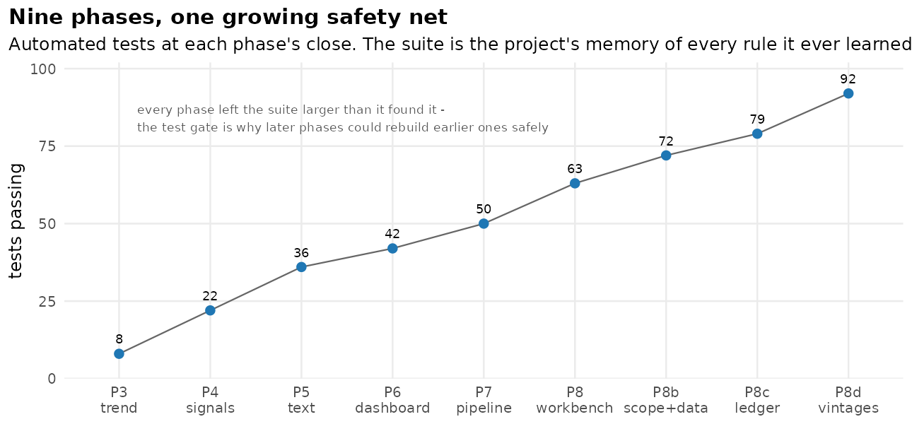
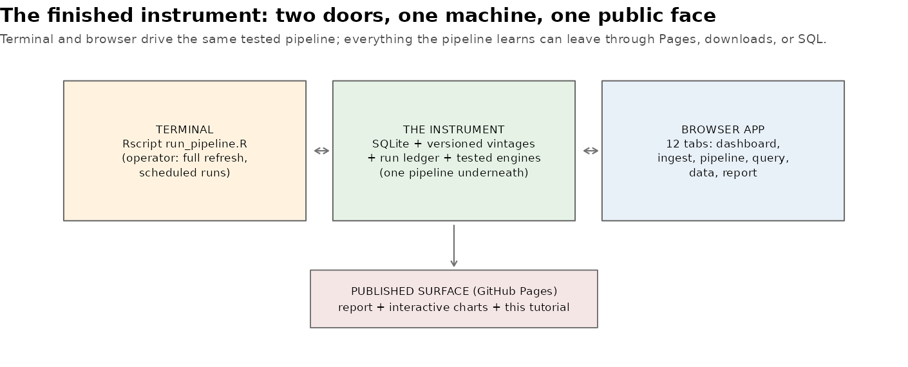

[← README](../README.md) · [All docs in order](../README.md#the-tutorial-in-order) · [Glossary](GLOSSARY.md)

# 13 — Phase 9: Packaging — release notes, roadmap, 1.0

**Prerequisites:** Phases 0–8d committed; the audit clean.
**Learning goal:** after this phase you will understand semantic
versioning, what release notes are for (and who they're for), why an
honest roadmap beats a silent one, what a software license does, and
what "done" means for a real project.
**Why this phase exists in a real workflow:** software isn't
finished when the code works — it's finished when a *stranger* can
tell what it is, what state it's in, what it promises, and what it
doesn't. Packaging is the difference between "my scripts" and "a
release."

**Session plan:** one short session (~45 min): files in → read →
verify the release surface → tag → push.

---

## 1. Concepts, plainly

**Versions are promises.** `v1.0.0` follows *semantic versioning* —
MAJOR.MINOR.PATCH: patch = fixes, minor = new capability that breaks
nothing, major = changes that break how things worked. Declaring
1.0 says: *the promises this README makes are now kept, and future
changes will say which kind they are.*

**Release notes are for the returning stranger** — including
future-you. `NEWS.md` (the R-world convention) answers "what is this
release, what's verified, what are the known limits?" in one page.
The limitations section is deliberately as prominent as the feature
list: a release that hides its edges isn't stable, it's unexamined.

**A roadmap is honesty about the future.** The README's Roadmap
section names what the project would grow next and *why each item
isn't built yet* — deferrals with reasons, not vague promises.
Interviewer's-eye truth: a considered roadmap demonstrates more
judgment than one extra half-built feature.

**A license makes the gift legal.** Without one, "public on GitHub"
still means all-rights-reserved. MIT (shipped here) says: use it,
learn from it, keep the notice. (A choice, not a default — swap it
if you prefer another; choosealicense.com compares.)

**The tag is the bookmark.** `git tag v1.0.0` names a commit
forever; GitHub turns it into a release page. Anyone can check out
exactly the 1.0 you shipped, no matter what happens next.



The curve above is the project's real epitaph: every phase left the
suite larger than it found it — and that gate is *why* later phases
could rebuild earlier ones (versioning the writes, scoping the
stages) without fear. The interactive version — hover any phase for
what it shipped — lives with its siblings:
[build timeline](https://akannan2987.github.io/orthowatch/interactive/build_timeline.html).



## 2. Get the Phase 9 files into your repo

| File | Goes in | Job |
|---|---|---|
| `NEWS.md` | root | Release notes: features, verifications, limits |
| `LICENSE` | root | MIT (your name; swap if you prefer another) |
| `13-phase-9-packaging.md` | `docs/` | This guide |
| `app.R` | `app/` (replaces) | v1.0.0 stamped in the About tab |
| `tests_growth.png`, `finished_instrument.png`, `make_illustrations.R` | `docs/img/` (last replaces) | The figures |
| `build_timeline.html` | `docs/interactive/` | The interactive timeline |
| `GLOSSARY.md`, `README.md` | replace | Release words; badges, roadmap, row 9 |

**Files-landed check** (validated):

```bash
ls NEWS.md LICENSE docs/13-phase-9-packaging.md docs/interactive/build_timeline.html
grep -c "v1.0.0" app/app.R        # expect 1
grep -c "Roadmap" README.md       # expect 1
grep -c "v1.0.0" NEWS.md          # expect 1
```

## 3. Verify the release surface, step by step

### 4.1 The stranger's path

Open the README top to bottom as a stranger would: title + badges →
Contents → the explainer → results with figures → build log → the
tutorial index (now ending in this doc) → Roadmap → honesty notes →
tree → how to run. Every claim links to its evidence; every
limitation is stated where a reader would meet it.

### 4.2 The app knows its version

Relaunch → **About** tab → "OrthoWatch v1.0.0" at the top. An
instrument that can't state its version can't be reasoned about in
a bug report.

### 4.3 Tests, one last time

```bash
Rscript tests/run_tests.R      # seven contexts, PASS 92
```

## 5. Checkpoint

1. README reads clean on the stranger's path (4.1).
2. About tab shows v1.0.0 (4.2).
3. Suite: 92 green (4.3).
4. `NEWS.md` and `LICENSE` at the repo root.

## 6. Commit checkpoint — and the tag

```bash
git add .
git status     # NEWS.md, LICENSE, doc 13, app.R, README, GLOSSARY,
               # img files, docs/interactive/build_timeline.html
git commit -m "Phase 9: v1.0.0 - release notes, MIT license, roadmap, build timeline (static + interactive), version stamp; the packaging finale"
git tag -a v1.0.0 -m "OrthoWatch 1.0.0 - the finished instrument"
git push origin develop develop:beta develop:master --tags
```

The `--tags` makes GitHub mint the release bookmark; the repo's
Releases page now offers "v1.0.0" forever.

## 7. What could go wrong (mini-FAQ)

**`--tags` pushed nothing** — tags push once; rerun
`git push origin v1.0.0` to push one explicitly.

**I want to change the license** — replace `LICENSE`, note it in
`NEWS.md` under a new version. Licenses changes are releases.

**Something ships after 1.0 — what version?** — fixes bump PATCH
(1.0.1); the roadmap items are MINORs (1.1.0: deployment; 1.2.0:
background execution…). `NEWS.md` grows a section per release,
newest on top.

**The timeline HTML is huge** — self-contained by design (~4 MB),
like every interactive here: one file, works anywhere, no CDN.

## 8. Two ways to run everything — the release itself

| Capability | Terminal | Web |
|---|---|---|
| Get exactly 1.0 | `git checkout v1.0.0` | GitHub → Releases → v1.0.0 |
| Read what 1.0 is | `NEWS.md` | the release page renders it |

---

**Next:** nothing — this is the finale. The roadmap names what a
1.1 would be; the [build timeline](https://akannan2987.github.io/orthowatch/interactive/build_timeline.html)
tells the story so far.
